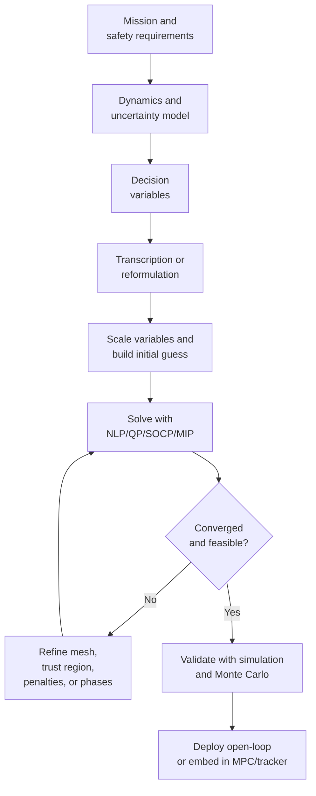
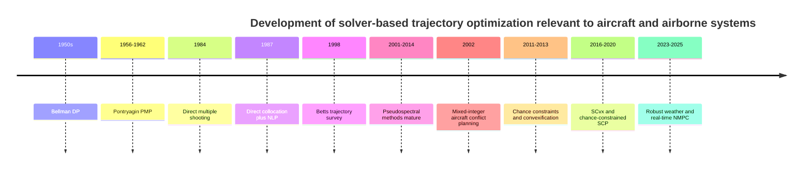

# Optimization Theory and Solver-Based Methods for Aircraft and Airborne Trajectory Generation

## Executive summary

This review assumes **no specific aircraft type or mission**. It covers solver-based trajectory generation for transport aircraft, fixed-wing UAVs, multirotors, and other airborne vehicles, while also citing a few non-aircraft papers from space and robotics when those papers introduced methods that later became standard in airborne trajectory optimization. The emphasis is on **model-based optimization**, **optimal control**, and **solver-centered formulations**, not machine learning. (refs: [R1](#ref-r1))

The main engineering conclusion is straightforward: for most realistic aircraft trajectory-generation problems, the default workhorse is **direct transcription**—especially **direct collocation** or **pseudospectral transcription**—followed by a **large sparse nonlinear program** solved by derivative-based NLP solvers such as **IPOPT**, **SNOPT**, or **WORHP**. These methods handle many path constraints, multiphase flight segments, and practical aircraft models much better than classical indirect boundary-value formulations. **Indirect methods** remain important for theory, sensitivity analysis, and benchmark solutions, but they are usually not the first implementation choice for complex constrained aircraft problems. (refs: [R1](#ref-r1), [R4](#ref-r4), [R7](#ref-r7), [S2](#ref-s2), [S3](#ref-s3))
> 阅读提示：Direct transcription 可以理解成“把连续时间问题离散成有限维优化问题”。原始 OCP 里有连续函数 $x(t),u(t)$；direct transcription 会把它们变成很多时间节点上的变量 $x_k,u_k$，然后交给 NLP solver。
> Direct collocation 是 direct transcription 的一种常用实现。它不仅在节点上放状态和控制，还用 collocation points / 配点约束动力学，使离散轨迹近似满足 $\dot{x}(t)=f(x(t),u(t),t)$。
> Pseudospectral transcription 也是 direct transcription 的一种高阶形式，通常用特殊节点和高阶多项式逼近整段轨迹。
> IPOPT = Interior Point OPTimizer，常用开源 sparse NLP solver；SNOPT = Sparse Nonlinear OPTimizer，基于 SQP / Sequential Quadratic Programming；KNITRO = Artelys Knitro，商业非线性优化 solver；WORHP = We Optimize Really Huge Problems，面向大规模非线性优化。

When the problem contains **logic**—for example, flight-level switches, conflict-resolution choices, passage side of an obstacle, waypoint disjunctions, or phase activation—continuous optimal control is not enough. Then the formulation becomes **mixed-integer** or **hybrid**, and solvers such as **Gurobi** or other MIP/MINLP tools become relevant. In air-traffic conflict resolution and hybrid flight planning, this is not a corner case but a core modeling issue. (refs: [R9](#ref-r9), [R8](#ref-r8), [R10](#ref-r10), [R20](#ref-r20), [S14](#ref-s14))

For faster online replanning, recent work increasingly favors **convexification**, **sequential convex programming**, **successive convexification**, and **model predictive control**. These trade some globality for speed and solver reliability. A useful practical rule is: use **large sparse NLP** for high-fidelity, offline or pre-tactical planning; use **QP/SOCP-based convexification or MPC** for receding-horizon onboard guidance; and use **mixed-integer formulations** only when the logic is genuinely essential. Uncertainty is best represented explicitly with **stochastic**, **robust**, or **chance-constrained** formulations, but those approaches demand more from both the model and the solver. (refs: [R13](#ref-r13), [R24](#ref-r24), [R22](#ref-r22), [R14](#ref-r14), [R18](#ref-r18), [R19](#ref-r19), [R11](#ref-r11), [R17](#ref-r17), [R23](#ref-r23))

## Problem formulation and modeling choices

A standard continuous-time trajectory-generation problem is an **optimal control problem**: choose a state history $x(\cdot)$, control history $u(\cdot)$, possibly static parameters $p$, and sometimes the start and end times, so as to minimize a terminal-plus-integral performance index subject to dynamics, path constraints, and boundary conditions. A common template is:

$$
\begin{aligned}
\min_{x(\cdot),u(\cdot),p,t_0,t_f}\quad
& \Phi\!\big(x(t_0),t_0,x(t_f),t_f,p\big)
+ \int_{t_0}^{t_f} L\!\big(x(t),u(t),p,t\big)\,dt \\
\text{s.t.}\quad
& \dot{x} = f(x,u,p,t), \\
& g(x,u,p,t)\le 0, \\
& \psi\!\big(x(t_0),t_0,x(t_f),t_f,p\big)=0 .
\end{aligned}
$$
> s.t. = subject to，表示“满足以下约束”。在最优控制里，目标函数不是单独最小化的，它必须同时满足动力学、路径约束和边界条件。

Here $L$ is the running cost, $\Phi$ is the endpoint cost, $g$ collects path constraints, and $\psi$ collects boundary/linkage constraints. This is the common backbone behind aircraft climb, cruise, descent, trajectory tracking, conflict-resolution, and obstacle-avoidance formulations. (refs: [R1](#ref-r1), [R15](#ref-r15))

The **dynamic model** determines almost everything that follows computationally. At one end are simple **kinematic** or geometry-based models, such as Dubins-like path generators. They are cheap and useful for front-end planning, but they can produce trajectories that are dynamically infeasible for the real aircraft. At the other end are **point-mass** and **6-DoF rigid-body** models, sometimes coupled to algebraic performance relations or atmosphere/wind models. Recent aircraft work still most commonly uses point-mass models for planning, because they keep the optimization manageable while representing thrust, drag, climb, mass burn, bank, and wind effects well enough for many mission-level questions. (refs: [R22](#ref-r22), [R1](#ref-r1))

> kinematic / geometry-based model: 不直接建模升力、阻力、推力、重力等力学细节，主要关注路径形状、转弯半径、航向、避障和几何可达性。
> point-mass model: 把飞机看成一个有质量的质点，显式建模升力、阻力、推力、重力对速度、航迹角、高度和航向的影响。它比纯几何路径更接近“能不能真的飞出来”，但还不是 6-DoF 刚体模型。

A representative aircraft point-mass formulation appears in flight-path optimization papers as

$$
\begin{aligned}
\dot V &= g\!\left(\frac{T\cos\alpha - D}{mg} - \sin\gamma\right),\\
\dot \gamma &= \frac{(T\sin\alpha + L)\cos\mu - mg\cos\gamma}{mV},\\
\dot{\psi}_h &= \frac{(T\sin\alpha + L)\sin\mu}{mV\cos\gamma},\\
\dot x &= V\cos\gamma\cos\psi_h,\qquad
\dot y = V\cos\gamma\sin\psi_h,\qquad
\dot h = V\sin\gamma .
\end{aligned}
$$

这些变量的含义如下。这里的 $g$ 表示重力加速度，不是前面通用最优控制模板里的路径约束函数 $g(\cdot)$。

| 符号 | 含义 |
|---|---|
| $V$ | 飞机沿航迹方向的速度，通常可理解为真空速 |
| $\gamma$ | 航迹角；正值表示爬升，负值表示下降 |
| $\psi_h$ | 水平面内的航向角或航迹角；下标 $h$ 表示 horizontal/heading，用来和前面的边界约束函数 $\psi(\cdot)$ 区分 |
| $x,y$ | 水平位置坐标 |
| $h$ | 高度 |
| $T$ | 推力大小 |
| $D$ | 阻力 |
| $L$ | 升力 |
| $m$ | 飞机质量 |
| $g$ | 重力加速度 |
| $\alpha$ | 迎角；在这个简化式中，它把推力分解为沿航迹方向的 $T\cos\alpha$ 和法向的 $T\sin\alpha$ |
| $\mu$ | 坡度角或滚转角；它把升力分解为竖直分量和横向转弯分量 |
| $\dot{(\ )}$ | 对时间求导，例如 $\dot V=dV/dt$ |

第一条方程描述的是**速度变化**。展开后等价于

$$
\dot V = \frac{T\cos\alpha-D}{m} - g\sin\gamma .
$$

其中 $T\cos\alpha-D$ 是沿航迹方向的净力：推力让飞机加速，阻力让飞机减速。$g\sin\gamma$ 是重力在航迹方向上的分量：爬升时它抵消加速，下降时它可能帮助加速。

第二条方程描述的是**航迹角变化**。分子比较的是速度法向上的可用力和重力法向分量：

$$
(T\sin\alpha+L)\cos\mu - mg\cos\gamma .
$$

升力和推力的法向分量会使速度方向向上转，重力会使速度方向向下转。除以 $mV$ 是把法向加速度转换成角速度。因此在同样的法向力下，飞机速度越大，航迹角 $\gamma$ 通常变化得越慢。

第三条方程描述的是**航向角变化**：

$$
\dot{\psi}_h = \frac{(T\sin\alpha + L)\sin\mu}{mV\cos\gamma}.
$$

只有法向力的横向分量会让飞机在水平面内转弯。这个横向分量主要由飞机倾斜产生，对应公式里的 $\sin\mu$。分母中的 $V\cos\gamma$ 是水平速度，因为 $\psi_h$ 是水平面内的角度。

最后三条方程是**位置运动学关系**。水平速度是 $V\cos\gamma$，航向角 $\psi_h$ 把它分解到 $x$ 和 $y$ 两个方向：

$$
\dot x = V\cos\gamma\cos\psi_h,\qquad
\dot y = V\cos\gamma\sin\psi_h .
$$

高度变化率是

$$
\dot h = V\sin\gamma .
$$

因此，$\gamma>0$ 表示高度增加，$\gamma<0$ 表示高度降低，$\gamma=0$ 在这个简化模型里对应平飞。

This is already rich enough to encode fuel-time-noise tradeoffs, flight-envelope limitations, terrain or approach-path geometry, and safety constraints. ATM-oriented planning often simplifies further to 3-DoF point-mass models with wind-coupled algebraic equations, latitude/longitude progression, and mass dynamics drawn from aircraft performance models such as BADA. (refs: [R1](#ref-r1), [S17](#ref-s17))
> flight envelope / 飞行包线：飞机能够安全飞行的状态范围，例如速度上下限、高度范围、最大载荷、最大迎角、最大爬升率等。优化轨迹如果跑出飞行包线，数学上也许有解，但物理上不可飞或不安全。

The objective function depends on the application. Common choices are **fuel burn**, **flight time**, **direct operating cost**, **tracking error**, **control effort**, **climate cost**, **noise metrics**, or weighted combinations of these. For commercial-aircraft 4D planning, multi-phase optimal-control formulations often combine fuel, time, emissions, and operational constraints; for UAS local planning, control smoothness and feasibility are often dominant; for ATM conflict resolution, the problem may even be a feasibility problem first and a cost-minimization problem second. (refs: [R19](#ref-r19), [R10](#ref-r10), [R20](#ref-r20))
> objective function / 目标函数：就是“优化器到底在最小化什么”。不同任务目标不一样：民航航路可能重视燃油和时间，低空无人机可能重视平滑和避障，空管冲突问题可能先要求可行和安全，再谈代价最小。

The decision variables can be split into two classes. **Continuous decisions** include thrust, bank angle, angle of attack, speed profile, climb rate, turn rate, or actuator histories. **Discrete decisions** include mode switches, whether to pass left or right of an obstacle, flight-level changes, whether to activate a phase, or which conflict-resolution maneuver family to choose. When those discrete decisions are important, the clean continuous OCP above becomes a **hybrid optimal-control problem** or a **mixed-integer optimal-control problem**. That modeling step is often more important than the eventual choice of solver. (refs: [R10](#ref-r10), [R20](#ref-r20))
> OCP = Optimal Control Problem，最优控制问题。continuous OCP 指所有主要决策变量都是连续量，例如推力大小、速度曲线、坡度角；hybrid / mixed-integer OCP 则加入离散选择，例如“左绕还是右绕”“换不换高度层”“某个飞行阶段是否激活”。一旦有离散选择，问题会明显更难，因为 solver 需要同时处理连续优化和组合搜索。

Uncertainty can enter through wind, atmospheric forecasts, initial mass, state-estimation error, obstacle location, or tracking error. Deterministic solvers then branch into three common styles: **robust optimization** for worst-case or variability-penalized performance, **stochastic expected-value optimization** for average performance across scenarios, and **chance-constrained optimization** for explicit probabilistic safety requirements. In aircraft planning under wind uncertainty, ensemble weather forecasts have become a standard way to generate scenario-based robust or stochastic formulations. (refs: [R15](#ref-r15), [R19](#ref-r19), [R11](#ref-r11), [R23](#ref-r23))
> uncertainty / 不确定性：指优化时不能完全确定的量，例如风场、传感器误差、初始质量、障碍物位置。robust optimization 偏保守，关心最坏情况；stochastic optimization 关心平均表现；chance-constrained optimization 关心“违反安全约束的概率不能超过某个阈值”。三者不是同义词，建模假设和计算成本都不同。

## Core methods and mathematical ideas

### Pontryagin, Bellman, and what they mean for trajectories

Two grand theoretical viewpoints dominate trajectory optimization. The first is **Pontryagin-style optimal control**, which turns the problem into necessary conditions on states, controls, and **costates**—that is, time-varying Lagrange multipliers attached to the dynamics. The second is **Bellman-style dynamic programming**, which solves for the **value function**—the best possible remaining cost from each state—and in principle produces a feedback law directly. These are complementary, not competing, viewpoints. (refs: [R1](#ref-r1), [R25](#ref-r25), [R27](#ref-r27), [R26](#ref-r26))

> Costate / 协态变量 / 伴随变量：可以理解成“状态变量的影子价格”。普通约束优化里的拉格朗日乘子告诉你某个约束的边际价值；最优控制里的 costate $\lambda(t)$ 则告诉你某个状态 $x(t)$ 在某个时刻对最终目标的边际价值。它和状态方程配套，通常从终端条件反向影响整条轨迹。

For

$$
J = \Phi(x(t_f))+\int_{t_0}^{t_f}L(x,u,t)\,dt,\qquad \dot x=f(x,u,t),
$$

form the augmented functional

$$
\bar J=\Phi(x(t_f))+\int_{t_0}^{t_f}\left[L(x,u,t)+\lambda^\top\!\big(f(x,u,t)-\dot x\big)\right]dt.
$$

After integration by parts and first-order variation, one obtains the **Hamiltonian**

$$
H(x,u,\lambda,t)=L(x,u,t)+\lambda^\top f(x,u,t),
$$

> Hamiltonian 在这里不是普通力学课里的总能量，而是最优控制里的辅助函数。$L(x,u,t)$ 表示当前这一瞬间的直接代价；$\lambda^\top f(x,u,t)$ 表示当前控制通过动力学改变状态后，对未来目标的价值影响。直观上，Hamiltonian 把“现在付出的代价”和“状态变化带来的未来价值”放在同一个式子里比较。

and the familiar necessary conditions

$$
\dot x=\frac{\partial H}{\partial \lambda}=f,\qquad
\dot \lambda=-\frac{\partial H}{\partial x},\qquad
u^\star(t)=\arg\min_{u\in U} H(x^\star,u,\lambda^\star,t),
$$

plus endpoint transversality conditions. This is the theoretical basis of **indirect methods** and of shooting-based solvers. It is extremely informative because the costate often reveals the physical “shadow price” of altitude, mass, time, or separation constraints. (refs: [R1](#ref-r1))
> endpoint transversality conditions: 终端横截条件，可以理解成最优轨迹在终点必须满足的额外必要条件。它们和起点/终点边界条件一起，使 PMP 方法通常变成 two-point boundary-value problem：一部分条件在起点，一部分条件在终点。

Bellman’s route starts from the **principle of optimality**: if the current state is $x$ at time $t$, then the first small slice of control plus the optimal continuation must itself be optimal. Writing

$$
V(x,t)=\min_{u(\cdot)}\left[\int_t^{t+\Delta t}L\,d\tau+V(x(t+\Delta t),t+\Delta t)\right]
$$

Subtracting $V(x,t)$ from both sides, approximating the short integral by $L(x,u,t)\Delta t$, and dividing by $\Delta t$ gives the intermediate residual form

$$
0=\min_{u\in U}\left(L(x,u,t)+\frac{V(x+f(x,u,t)\Delta t,t+\Delta t)-V(x,t)}{\Delta t}\right),\qquad \Delta t\to0.
$$

Expanding $V(x+f(x,u,t)\Delta t,t+\Delta t)$ to first order then yields the continuous-time **Hamilton–Jacobi–Bellman equation**

$$
0=\min_{u\in U}\Big(L(x,u,t)+V_t(x,t)+\nabla_x V(x,t)^\top f(x,u,t)\Big).
$$

> 这个式子叫 Hamilton-Jacobi-Bellman equation，简称 HJB。它不是在求一条单独的轨迹，而是在整个状态空间上求 value function $V(x,t)$。
> 左边的 $0$ 不是说代价为零，而是表示 Bellman 最优性条件的“残差”为零。直观推导是：从 $V(x,t)$ 出发，先走一个很小时间步 $\Delta t$，付出当前代价 $L\,\Delta t$，再加上下一状态的最优未来代价 $V(x+f\Delta t,t+\Delta t)$；把这个 Bellman 等式两边的 $V(x,t)$ 相减，再除以 $\Delta t$ 并令 $\Delta t\to0$，就得到 $0=L+V_t+\nabla_x V^\top f$。因此左边写成 $0$，表示“当前代价 + 未来 value function 的变化”在最优控制下必须刚好平衡。
> $V(x,t)$ 表示：系统在时间 $t$ 处于状态 $x$ 时，从这里继续到终点所能达到的最小未来代价。
> $L(x,u,t)$ 是当前这一瞬间的 running cost，例如燃油消耗率、时间代价或控制代价。
> $V_t(x,t)$ 是 value function 对时间的变化率，表示“剩余时间变少”会怎样改变未来最优代价。
> $\nabla_x V(x,t)^\top f(x,u,t)$ 表示当前控制 $u$ 通过动力学 $\dot{x}=f(x,u,t)$ 改变状态后，对未来代价造成的影响。
> $\min_{u\in U}$ 表示在所有允许控制里选择让“当前代价 + 未来代价变化”最小的控制。
> 所以 HJB 的直观意思是：最优控制在每个状态和时间上，都要让当前一步的代价与未来 value function 的变化达到最优平衡。解出 $V(x,t)$ 后，可以得到反馈策略，而不只是得到一条开环轨迹。

This is theoretically stronger than PMP because it characterizes optimal feedback, not just optimal trajectories. In aircraft work it has been used for low-dimensional flight-path optimization and feedback-style arrival/approach problems, but in practice it is most effective when the state dimension is modest. (refs: [R26](#ref-r26), [R1](#ref-r1))

The practical conclusion is easier to understand if the two theoretical routes are separated.

**PMP** means **Pontryagin Maximum Principle**. It is the basis of many **indirect methods**: first derive the necessary conditions for optimality, then solve the resulting equations. These equations include the original state dynamics, the costate dynamics, and the Hamiltonian optimality condition. The difficulty is that this usually becomes a **two-point boundary-value problem**: the aircraft state is constrained at the start, while costate or transversality conditions are often imposed at the end. Numerically, one has to guess missing costates, switching times, or arc structures so that the final boundary conditions are hit exactly. Small changes in those guesses can cause large terminal errors, especially for long aircraft trajectories, active path constraints, or multiphase missions.

**HJB/DP** means **Hamilton-Jacobi-Bellman / Dynamic Programming**. Instead of solving for one trajectory, it solves for a value function $V(x,t)$ over the state space. This is theoretically attractive because the value function gives a feedback policy: if the aircraft is at state $x$ at time $t$, the policy tells it what to do next. On a solved grid, this can provide global optimality relative to that grid. The difficulty is computational: if each state dimension uses $N$ grid points and the model has $n$ states, the grid can scale like $N^n$. Even a moderate aircraft model with states such as position, altitude, speed, flight-path angle, heading, and mass can become too large very quickly.

That is why **direct transcription** became the practical default in much aircraft trajectory optimization. It does not try to solve the costate boundary-value problem directly, and it does not solve over the entire state-space grid. Instead, it discretizes the trajectory itself: states and controls at time nodes become decision variables, dynamics become algebraic constraints, and the result is a large but sparse nonlinear program. This loses the clean global guarantees of HJB and usually gives only a local optimum, but it is much easier to combine with aircraft envelope constraints, fuel models, terrain or separation constraints, and multiphase flight procedures. (refs: [R1](#ref-r1))

### Direct transcription, shooting, and collocation

**Direct methods** replace function-space optimization by a finite-dimensional optimization problem. The simplest variant is **single shooting**: parameterize only the control, integrate the differential equations forward, and optimize over control parameters. The drawback is fragility—errors or poor guesses can explode through the forward integration, especially for unstable dynamics or long horizons. **Multiple shooting** improves this by cutting the trajectory into segments and introducing intermediate state variables, then enforcing continuity between segments. Bock and Plitt’s 1984 paper is a classic here. (refs: [R2](#ref-r2), [R4](#ref-r4))

The other major class is **collocation**. Start from

$$
x_{k+1}-x_k=\int_{t_k}^{t_{k+1}} f(x(t),u(t),t)\,dt,
$$

then approximate the integral numerically and enforce the resulting algebraic relation as a constraint. For **trapezoidal collocation**,
> trapezoidal: 梯形的

$$
x_{k+1}-x_k \approx \frac{h_k}{2}\big(f_k+f_{k+1}\big),
$$

where $h_k=t_{k+1}-t_k$. This relation is often called a **defect constraint**—meaning the discretized dynamics residual that must be driven to zero. For trapezoidal collocation, the defect on interval $k$ can be written as

$$
\Delta_k =
x_{k+1}-x_k-\frac{h_k}{2}\big(f_k+f_{k+1}\big).
$$

> Defect constraint 可以理解成“动力学残差约束”或“离散动力学误差约束”。优化器会选择节点状态 $x_k,x_{k+1}$ 和控制量，但这些节点不能随便连起来；它们必须近似满足连续动力学 $\dot{x}=f(x,u,t)$。如果 $\Delta_k\ne0$，说明相邻两个状态点之间的变化和动力学积分预测不一致；如果强制 $\Delta_k=0$，就表示这段离散轨迹 obey dynamics。这里的 defect 不是“故障”，而是“离散化后留下的动力学误差”。 (refs: [R4](#ref-r4))

For **Hermite–Simpson collocation**, the same integral is approximated by Simpson quadrature:
> Hermite-Simpson collocation: 一种比 trapezoidal 更高阶的配点方法。它不只看区间两端 $k$ 和 $k+1$，还引入中点 $k+\frac12$，用 Simpson 积分规则近似这段动力学积分。直观上：trapezoidal 像“用直线连两端”，Hermite-Simpson 像“用一段弯曲的三次多项式连接两端”，所以通常更平滑、更准确。

$$
x_{k+1}-x_k \approx \frac{h_k}{6}\Big(f_k+4f_{k+\frac12}+f_{k+1}\Big),
$$

with the midpoint state approximated by

$$
x_{k+\frac12}\approx \frac12(x_k+x_{k+1})+\frac{h_k}{8}(f_k-f_{k+1}).
$$

> 这里的 $f_k$ 表示在节点 $k$ 处由动力学方程算出的 $\dot{x}$，$f_{k+1}$ 表示节点 $k+1$ 处的 $\dot{x}$，$f_{k+\frac12}$ 表示中点处的 $\dot{x}$。系数 $1,4,1$ 来自 Simpson quadrature：中点信息权重更大，因为它帮助描述区间内部的弯曲趋势。第二个公式是在估计中点状态 $x_{k+\frac12}$，这样优化器可以同时约束端点和中点的动力学一致性。

This raises the local order of accuracy and usually improves smoothness and solver behavior for many aircraft problems. Kelly’s tutorial remains one of the clearest modern introductions. (refs: [R4](#ref-r4))

Why do engineers like collocation so much? Because it exposes a **large sparse NLP**. Each node mainly couples only to nearby nodes, so Jacobians and Hessians have exploitable structure. This is exactly the regime where sparse derivative-based NLP solvers are strong. Hargraves and Paris’ 1987 paper helped establish this practical direction, and Betts’ later work consolidated it into the standard aircraft and aerospace workflow. (refs: [R3](#ref-r3), [R1](#ref-r1))
> large sparse NLP: 大规模稀疏非线性规划。large 是因为每个时间节点都有状态和控制变量，节点一多变量就很多；sparse 是因为节点 $k$ 的动力学约束通常只和附近节点 $k,k+1$ 或中点有关，不会和所有节点都耦合。Jacobian 是约束对变量的一阶导数矩阵，Hessian 是目标/拉格朗日函数的二阶导数矩阵。稀疏结构让 IPOPT、SNOPT、WORHP 这类 solver 可以只处理非零块，而不是把整个巨大矩阵当成 dense matrix。

### Pseudospectral methods

**Pseudospectral methods** are a global form of orthogonal collocation: instead of using many local low-order segments, one approximates the state by high-order polynomials over the whole phase—or over hp-adaptively refined mesh elements—and enforces the dynamics at carefully chosen nodes such as **Legendre–Gauss**, **Legendre–Gauss–Radau**, or **Legendre–Gauss–Lobatto** points. The attraction is rapid convergence for smooth solutions and a deep connection between NLP multipliers and continuous-time costates. (refs: [R5](#ref-r5), [R6](#ref-r6), [R7](#ref-r7))
> Pseudospectral method: 可以理解成“用少量特殊节点 + 高阶多项式”逼近整段轨迹。local collocation 是把时间切成很多小段，每段用低阶近似；pseudospectral 是在一整段 phase 内用更高阶的全局多项式。Legendre-Gauss / Radau / Lobatto 是几类特殊的配点位置，它们不是随便均匀取点，而是为了让积分和导数近似更准确。
> hp-adaptive: $h$ 指调整 mesh interval 的长度或数量，$p$ 指调整多项式阶数。hp-adaptive mesh refinement 就是 solver 发现某段误差大时，可以把那段切得更细，或者提高那段多项式阶数。

A good mental model is this: local collocation behaves like a finite-element method, while pseudospectral methods behave more like a high-order spectral approximation. For very smooth flight segments, pseudospectral methods can be remarkably accurate with relatively few nodes. That is why tools such as **GPOPS-II** became so influential in aerospace. GPOPS-II uses **hp-adaptive Gaussian quadrature collocation** and transcribes the OCP to a sparse NLP with mesh refinement. (refs: [R7](#ref-r7), [S16](#ref-s16))
> 这里的 mental model 是：local collocation 更像“很多小块拼起来”，pseudospectral 更像“用一条高阶曲线拟合一整段”。如果轨迹很光滑，高阶曲线很有效；如果轨迹有突然切换或不连续，高阶曲线容易振荡或拟合不好。

The catch is that global polynomial methods are less comfortable with **nonsmooth structure**—for example, sharp switching, bang-bang controls, active-set changes, or singular arcs—unless the phase structure is chosen carefully. GPOPS-II’s own paper explicitly notes that solutions near singular arcs may be inaccurate unless the singular conditions are added to the model. That is a useful warning for aircraft problems with throttle saturation, time-optimal segments, or mode boundaries. (refs: [R7](#ref-r7))
> nonsmooth structure: 指轨迹或控制不是平滑变化，而是有切换、饱和、拐点或约束突然变 active。bang-bang control 是控制量在上下限之间跳，比如油门要么最大要么最小。active-set change 是某个约束从“不起作用”变成“正好卡住边界”，例如速度达到最大包线。singular arc 是一种更微妙的最优控制段：简单的 Hamiltonian 最优条件不能直接决定控制值，需要额外条件。全局高阶多项式最怕这些“不光滑”的地方，所以实际建模时常把不同 phase 分开。

### Convexification, sequential convex programming, and chance constraints

Many trajectory problems are nonconvex because of nonlinear dynamics, obstacle-avoidance geometry, aerodynamic envelopes, and separation constraints. A common modern tactic is **sequential convex programming** or **successive convexification**. If the full problem is written as
> nonconvex: 非凸问题，直观上就是可行域或目标函数形状可能有多个坑，局部最优不一定是全局最优。飞机轨迹优化很容易 nonconvex：动力学非线性、避障约束、最小转弯半径、飞行包线、飞机间隔约束都会带来非凸性。
> sequential convex programming / successive convexification: 顺序凸规划。核心思想不是一次性硬解原始非凸问题，而是在当前猜测轨迹附近，把非凸问题线性化/凸化成一个更容易解的凸子问题；解完后更新轨迹，再重复这个过程。

$$
\min_z J(z)\quad \text{s.t.}\quad c(z)=0,\quad g(z)\le 0,
$$

then around a reference iterate $z^{(i)}$, one solves a convex subproblem in the step $\Delta z$:
> 这里 $z$ 是把所有决策变量打包后的大向量，可能包括所有时间节点上的状态、控制、时间、参数等。$c(z)=0$ 表示等式约束，例如动力学 defect constraint；$g(z)\le0$ 表示不等式约束，例如速度上限、高度下限、避障距离等。$z^{(i)}$ 是第 $i$ 次迭代时的当前猜测轨迹，$\Delta z$ 是本轮 solver 准备走的一步。

$$
\begin{aligned}
c(z^{(i)})+\nabla c(z^{(i)})\Delta z &= 0,\\
g(z^{(i)})+\nabla g(z^{(i)})\Delta z &\le 0,\\
\|\Delta z\| &\le \rho_i,
\end{aligned}
$$

possibly with **virtual controls** or **exact penalties** to preserve feasibility. The bound $\rho_i$ is the **trust region**—a solver-imposed step limit meant to keep the linearization credible. The solution is then updated by $z^{(i+1)}=z^{(i)}+\Delta z$. (refs: [R13](#ref-r13), [R22](#ref-r22), [R21](#ref-r21))
> 上面两个含有 $\nabla c,\nabla g$ 的式子就是一阶线性化：用当前点附近的切线/切平面近似原来的非线性约束。$\|\Delta z\|\le\rho_i$ 是 trust region，意思是“这次不要走太远”。因为线性化只在当前点附近可信，如果一步跨太大，近似就可能完全失真。virtual controls 是临时加入的松弛量，用来避免线性化子问题无解；exact penalties 是对违反约束的行为加很大的惩罚，让 solver 倾向于恢复可行性。

A special case is **lossless convexification**, where a specific nonconvex constraint set can be turned into a convex one *without changing the optimal solution*. This idea was developed most famously in flight-vehicle guidance with nonconvex control-bound or pointing constraints, and it strongly influenced later airborne applications even when exact “losslessness” no longer holds and one switches to sequential convexification instead. (refs: [R24](#ref-r24))
> lossless convexification: “无损凸化”。普通凸化通常会改变原问题，只是希望近似得好；lossless convexification 更强，指在某些特殊结构下，可以把非凸约束改写成凸约束，而且最优解不变。它很有吸引力，但不是所有飞机轨迹问题都满足这种特殊结构，所以更常见的是 sequential convexification 这种迭代近似方法。

For uncertainty, a canonical formulation is the **chance constraint**

$$
\mathbb{P}\big(g_j(x_k,u_k,\xi_k)\le 0\big)\ge 1-\varepsilon_j ,
$$

where $\xi_k$ represents uncertainty and $\varepsilon_j$ is the allowed risk budget. In practice, these are handled by deterministic reformulations, conservative uncertainty margins, scenario sampling, risk allocation, or chance-constrained MPC/SCP variants. This is attractive because it encodes safety in the language engineers actually use—“keep collision probability below $10^{-3}$”—but it raises both modeling and computational burden. (refs: [R11](#ref-r11), [R17](#ref-r17), [R23](#ref-r23), [R16](#ref-r16))
> chance constraint: 概率约束。$g_j(x_k,u_k,\xi_k)\le0$ 是第 $j$ 个安全/性能约束，$\xi_k$ 表示不确定性，例如风、障碍物位置误差、传感器误差。$\mathbb{P}(\cdot)\ge1-\varepsilon_j$ 的意思是：这个约束不要求在所有可能情况下都满足，而是要求满足的概率至少为 $1-\varepsilon_j$。如果 $\varepsilon_j=10^{-3}$，就是允许最多约 $0.1\%$ 的违反概率。难点是概率分布、相关性和极端情况都要建模，否则这个约束看起来严谨，实际可能过于保守或不够安全。

A useful special airborne case is the **minimum-snap polynomial** formulation for differentially flat multirotors. If a flat output $p(t)$ is represented by piecewise polynomials $p_i(t)$, one solves a convex QP such as
> minimum-snap: snap 是位置对时间的四阶导数，也就是 jerk 的导数。对 quadrotor 来说，轨迹太“抖”会导致姿态和电机指令剧烈变化，所以常最小化 snap，让轨迹更平滑。differentially flat 表示系统的状态和控制可以由少数 flat outputs 及其导数表示；对多旋翼，位置和 yaw 常可作为 flat outputs。这也是为什么 minimum-snap 对 quadrotor 很漂亮，但不一定能直接迁移到普通固定翼飞机。

$$
\min_a \sum_i \int_{t_i}^{t_{i+1}}\left\|\frac{d^4 p_i(t)}{dt^4}\right\|^2 dt
$$

subject to waypoint, corridor, continuity, and derivative-bound constraints. For quadrotors this is elegant, fast, and influential—but it is also a specialized modeling trick, not a universal aircraft method. (refs: [R12](#ref-r12))
> QP 是 quadratic programming，二次规划。这里目标函数是多项式系数 $a$ 的二次函数，约束通常是线性的，例如经过某些 waypoint、保持多项式段之间连续、速度/加速度不超过上限。因此它比一般非线性 OCP 更容易快速求解。

## Solver-centered modeling patterns in aircraft trajectory generation

The modeling-to-solver pipeline in current aircraft trajectory work is usually less about “finding the perfect algorithm” than about **matching model structure to solver structure**. Smooth multi-phase OCPs with many continuous variables are typically sent to sparse NLP solvers; binary logic is isolated into MIP or MINLP layers; and repeated receding-horizon problems are condensed into QP/SOCP/NMPC forms that can be solved in milliseconds to seconds depending on horizon and model size. Recent aircraft and UAV papers follow exactly this pattern. (refs: [R19](#ref-r19), [R10](#ref-r10), [R22](#ref-r22), [R18](#ref-r18))
> 这一节的核心不是再介绍一个新算法，而是讲“问题长什么样，就该交给哪类 solver”。如果变量连续、动力学光滑、约束很多，通常是 sparse NLP；如果有 yes/no、左/右绕行、是否换高度层这种离散选择，就需要 MIP/MINLP；如果要实时滚动重规划，就常把问题改写成 QP/SOCP/NMPC 这类能快速重复求解的形式。
> 缩写提示：NLP = nonlinear programming；QP = quadratic programming；SOCP = second-order cone programming；MIP = mixed-integer programming；MINLP = mixed-integer nonlinear programming；NMPC = nonlinear model predictive control。

In practice, modern groups often combine **front-end geometry** with **back-end optimal control**. A safe corridor or rough waypoint route is first generated by a simple planner; then a continuous optimization stage smooths it into a dynamically feasible trajectory. Fixed-wing UAV work using **safe flight corridors plus SCP** is a good current example. Another current pattern is **collocation plus successive linear programming**, where the sparse collocation structure is retained but the nonlinear solve is broken into a sequence of LPs or QPs for speed and robustness. (refs: [R21](#ref-r21), [R22](#ref-r22))
> front-end geometry / back-end optimal control: 前端几何规划先给一条“大概安全”的路径，比如 waypoint、A*、RRT、安全走廊；后端最优控制再把这条粗路径变成满足动力学、速度、爬升率、转弯半径等约束的可飞轨迹。这样做的原因是：直接在完整动力学里同时搜索路径和控制太难，先几何后动力学可以把问题拆开。
> safe corridor: 安全走廊，可以理解成一串允许飞行的空间区域。后端优化不必直接处理复杂障碍物几何，只要保证轨迹待在这些 corridor 里。
> Monte Carlo checks: 蒙特卡洛验证。把风、初始误差、传感器误差等随机抽样很多次，反复仿真，看轨迹在不确定情况下是否仍然安全。

The table below summarizes the main method families from a solver-centric viewpoint.
> 下面这张表建议按三列来读：第一看“Continuous vs. discrete decisions”，判断问题有没有离散逻辑；第二看“Typical airborne model”，判断模型复杂度；第三看“Good solver/tool stack”，对应到可用的软件工具。不要把表理解成严格分类，真实工程经常会混合使用，比如 front-end 用几何/MIP，back-end 用 collocation/NLP，online tracking 再用 MPC。

| Method family | Continuous vs. discrete decisions | Typical airborne model | Main strengths | Main limitations | Good solver/tool stack | Key source(s) |
|---|---|---|---|---|---|---|
| **Indirect PMP + shooting** | Mostly continuous | Smooth ODEs, low-to-moderate complexity | Very sharp theory, good sensitivity insight, costates come “for free” | Sensitive boundary-value solve; awkward with many path inequalities and mode logic | Boundary-value solvers; sometimes shooting wrapped in SNOPT/IPOPT | (refs: [R1](#ref-r1)) |
| **Direct single shooting** | Continuous | Short horizons, simple controls, accurate integration needed | Small decision vector; easy conceptually | Sensitive to initial guess; poor handling of many path constraints | CasADi/ACADO front ends + NLP solver | (refs: [R4](#ref-r4), [S5](#ref-s5)) |
| **Direct multiple shooting** | Continuous | Nonlinear or unstable dynamics, moderate path constraints | More robust than single shooting; accurate integration on each segment | NLP becomes denser than collocation; continuity constraints add size | ACADO/CasADi + IPOPT/SNOPT/WORHP | (refs: [R2](#ref-r2), [R4](#ref-r4), [S5](#ref-s5)) |
| **Local collocation** | Continuous, possibly multiphase | Point-mass to 6-DoF aircraft OCPs | Sparse NLP; path constraints are natural; strong practical default | Mesh choice matters; still only local optima | IPOPT, SNOPT, WORHP via ICLOCS2, FALCON.m, CasADi | (refs: [R3](#ref-r3), [R4](#ref-r4), [R1](#ref-r1), [S6](#ref-s6)) |
| **Pseudospectral / hp-adaptive collocation** | Continuous, multiphase | Smooth long-horizon trajectories | Very high accuracy on smooth problems; multiplier–costate links; mesh refinement | Less friendly to nonsmooth arcs; singular arcs need care | GPOPS-II + IPOPT/SNOPT | (refs: [R6](#ref-r6), [R5](#ref-r5), [R7](#ref-r7), [S16](#ref-s16)) |
| **Lossless convexification / SCP / SCvx / SLP** | Continuous | Nonconvex obstacle-avoidance, envelope, or guidance problems | Fast convex subproblems; good for online replanning; strong recent momentum | Needs trust-region and penalty design; usually local convergence | MOSEK / ECOS for conic forms; OSQP / HPIPM for QP forms; custom SCP code | (refs: [R24](#ref-r24), [R13](#ref-r13), [R22](#ref-r22), [R21](#ref-r21)) |
| **MILP / MIQP / MINLP / hybrid OCP** | Continuous + discrete | Conflict resolution, waypoint logic, flight-level changes, hybrid procedures | Handles logic explicitly; can yield global optima relative to the model | Combinatorial growth; often needs simplified dynamics or decomposition | Gurobi for MIP/MIQP/MIQCP; MINLP stacks for hybrid models | (refs: [R9](#ref-r9), [R8](#ref-r8), [R10](#ref-r10), [R20](#ref-r20), [S14](#ref-s14)) |
| **MPC / NMPC** | Continuous, sometimes mixed-integer or stochastic | Tracking, local replanning, onboard guidance | Feedback, warm starting, constraint handling, natural online use | Horizon myopia; repeated solves; model mismatch matters | acados + HPIPM; qpOASES / OSQP for linear MPC; FORCESPRO for embedded deployments | (refs: [R14](#ref-r14), [R16](#ref-r16), [R18](#ref-r18), [S8](#ref-s8), [S9](#ref-s9), [S15](#ref-s15)) |
| **DP / HJB** | Continuous or discrete on a grid | Simplified feedback planning, low-dimensional approach or conflict models | Direct feedback policy; global optimality on solved state grid | Computationally heavy as dimension grows | Custom DP/PDE solvers | (refs: [R26](#ref-r26), [R1](#ref-r1)) |
| **Chance-constrained OCP / MPC** | Continuous, sometimes plus discrete risk allocation | Wind uncertainty, obstacle uncertainty, collision-probability limits | Encodes risk directly; better safety interpretation | Distribution assumptions, conservatism, extra computation | Scenario-based MPC/SCP, deterministic reformulations, sampling-based planners | (refs: [R11](#ref-r11), [R17](#ref-r17), [R23](#ref-r23), [R16](#ref-r16)) |

A second practical question is simple but important: **which solver should I actually use?** The short answer is “match the algebraic form.” Derivative-based sparse NLP solvers such as IPOPT, SNOPT, and WORHP remain the standard choices for smooth direct-transcription problems; conic or QP solvers such as MOSEK, ECOS, OSQP, HPIPM, and qpOASES are natural when the subproblem is convexified into LP/QP/SOCP form; and Gurobi is a strong default when binary decisions are unavoidable. Modeling/AD frameworks such as CasADi, ACADO, FALCON.m, ICLOCS2, and GPOPS-II matter almost as much as the solver itself because they determine derivative quality, sparsity exploitation, and ease of mesh refinement. (refs: [S1](#ref-s1), [S2](#ref-s2), [S3](#ref-s3), [S12](#ref-s12), [S13](#ref-s13), [S11](#ref-s11), [S9](#ref-s9), [S10](#ref-s10), [S14](#ref-s14), [S4](#ref-s4), [S5](#ref-s5), [S6](#ref-s6), [S7](#ref-s7), [R7](#ref-r7))
> “match the algebraic form” 的意思是：先看你最终写出来的数学问题是哪种形式，再选 solver。不要先迷信某个 solver。光滑非线性 + 稀疏约束适合 IPOPT/SNOPT/WORHP；凸二次或锥约束适合 OSQP/MOSEK/ECOS/HPIPM；有整数变量适合 Gurobi；需要自动微分、生成雅可比和 Hessian、做 mesh refinement 时，CasADi/GPOPS-II/ICLOCS2 这类建模框架也很关键。

| Problem type | Recommended solver stack | Why this is usually a good fit | Key source(s) |
|---|---|---|---|
| Smooth, sparse, offline aircraft OCP | **IPOPT**, **SNOPT**, **WORHP** | Handles large sparse NLPs from collocation/pseudospectral transcriptions | (refs: [S1](#ref-s1), [S2](#ref-s2), [S3](#ref-s3)) |
| Multi-phase hp-pseudospectral OCP | **GPOPS-II** with **IPOPT/SNOPT** | Mature aerospace workflow for smooth multi-phase problems | (refs: [R7](#ref-r7), [S16](#ref-s16)) |
| Rapid prototyping of direct transcription or NMPC | **CasADi**, **ACADO**, **ICLOCS2**, **FALCON.m** | Automatic differentiation, code generation, and structured OCP interfaces | (refs: [S4](#ref-s4), [S5](#ref-s5), [S7](#ref-s7), [S6](#ref-s6)) |
| Real-time QP-based MPC / convexified replanning | **acados + HPIPM**, **qpOASES**, **OSQP** | Fast repeated QP solves with OCP structure and warm-start support | (refs: [S8](#ref-s8), [S9](#ref-s9), [S10](#ref-s10), [S11](#ref-s11)) |
| Conic SCP / SOCP formulations | **MOSEK**, **ECOS** | Strong support for conic optimization and embedded SOCPs | (refs: [S12](#ref-s12), [S13](#ref-s13)) |
| Mixed-integer conflict/hybrid logic | **Gurobi** | Mature MIP/MIQP/MIQCP support for branch-and-bound/branch-and-cut workflows | (refs: [S14](#ref-s14), [R20](#ref-r20)) |
| Embedded repeated NMPC solves | **FORCESPRO**, **acados** | Designed for repeated real-time solves and code generation | (refs: [S15](#ref-s15), [S8](#ref-s8)) |

One practical recommendation deserves to be stated plainly: **scaling and derivatives are not housekeeping details; they are often the difference between success and failure**. Solver documentation and modern OCP software consistently emphasize analytic derivatives, automatic differentiation, and careful structure exploitation. (refs: [S3](#ref-s3), [S4](#ref-s4), [S6](#ref-s6))
> scaling: 变量尺度归一化。例如高度可能是 $10^4$ 米，角度可能是 $10^{-1}$ 弧度，燃油流量又是另一个量级；如果直接交给 solver，数值条件会很差。derivatives: solver 需要目标函数和约束的一阶/二阶导数。用 automatic differentiation 或解析导数通常比有限差分更稳定。很多“solver 不收敛”不是算法不行，而是 scaling、初值、导数质量或稀疏结构处理不好。

## Seminal papers, current directions, and how the field developed

The broad development arc is from general optimal-control theory, to multiple shooting and collocation, to sparse-NLP software, and then to modern real-time convexification, MPC, and uncertainty-aware planning. Bellman’s dynamic programming and Pontryagin’s maximum principle set the theory; Bock, Hargraves, and Betts made numerical trajectory optimization practical; pseudospectral methods pushed accuracy and multiplier recovery; mixed-integer aviation papers handled logic and conflict resolution; and current work emphasizes robust weather-aware planning, real-time convexification, and chance-constrained safety. (refs: [R27](#ref-r27), [R26](#ref-r26), [R2](#ref-r2), [R3](#ref-r3), [R1](#ref-r1), [R6](#ref-r6), [R7](#ref-r7), [R9](#ref-r9), [R10](#ref-r10), [R19](#ref-r19), [R22](#ref-r22), [R17](#ref-r17))
> 这段历史线可以按“理论 → 数值离散 → 工程软件 → 实时/不确定性”来理解：Bellman/Pontryagin 给理论，shooting/collocation 把问题变成可算的数值问题，sparse NLP 和 pseudospectral 工具让大规模航空问题可解，后来的 SCP/MPC/chance constraints 则面向在线重规划和不确定环境。

> Timeline 阅读提示：图里故意缩短了文字，避免 Mermaid 渲染时框内文字被截断。完整含义是：1950s 的 Bellman DP 和 1956-1962 的 Pontryagin PMP 奠定理论；1980s-1990s 的 shooting/collocation/NLP 让轨迹优化变成工程可算问题；2000s 的 pseudospectral 和 mixed-integer 方法处理高精度连续轨迹与离散逻辑；2010s 之后的 chance constraints、convexification、SCP、NMPC 则主要服务于不确定性和实时规划。

In the tables below, the final column now uses numbered references that jump to the full bibliography.
> 原始生成稿里的 `turn20view0`、`turn14view1` 这类 source ID 是临时检索句柄，不是正式论文编号，也不是公开 URL。现在正文用 `[R#]` 引到文末 paper/book references，用 `[S#]` 引到 solver/software references；文末条目再给 DOI、arXiv 或官方页面。
> 后面两张 paper 表不是要求一次读完。建议先抓主线：Betts/Kelly/GPOPS-II 负责 direct/collocation/pseudospectral 基础；Richards/Pallottino/Bonami/Cafieri 负责 mixed-integer 和 conflict logic；Mao/Lew/Lu/Sun 负责 convexification/SCP 这条现代实时规划路线。

| Foundational paper | Why it matters | References |
|---|---|---|
| **Bock & Plitt (1984), “A Multiple Shooting Algorithm for Direct Solution of Optimal Control Problems”** | The classic direct multiple-shooting paper; still foundational for robust shooting-based OCP transcription. | (refs: [R2](#ref-r2)) |
| **Hargraves & Paris (1987), “Direct trajectory optimization using nonlinear programming and collocation”** | One of the seminal “direct collocation + NLP” papers in aerospace practice. | (refs: [R3](#ref-r3)) |
| **Betts (1998), “Survey of Numerical Methods for Trajectory Optimization”** | The canonical survey that organized direct vs. indirect methods for trajectory applications. | (refs: [R1](#ref-r1)) |
| **Fahroo & Ross (2001), “Costate Estimation by a Legendre Pseudospectral Method”** | Important bridge between direct pseudospectral discretizations and indirect-style costate information. | (refs: [R5](#ref-r5)) |
| **Richards & How (2002), “Aircraft Trajectory Planning With Collision Avoidance Using Mixed Integer Linear Programming”** | Early, highly influential use of MILP for aircraft collision avoidance and large-scale fixed-wing maneuvers. | (refs: [R8](#ref-r8)) |
| **Pallottino, Feron & Bicchi (2002), “Conflict Resolution Problems for Air Traffic Management Systems Solved with Mixed Integer Programming”** | Foundational aircraft-conflict MIP paper; still a reference point for ATM optimization. | (refs: [R9](#ref-r9)) |
| **Garg et al. (2010), “A unified framework for the numerical solution of optimal control problems using pseudospectral methods”** | Standard reference on LG/LGR/LGL pseudospectral transcription. | (refs: [R6](#ref-r6)) |
| **Blackmore, Ono & Williams (2011), “Chance-Constrained Optimal Path Planning With Obstacles”** | Seminal chance-constrained planning paper; not aviation-specific, but methodologically central for risk-bounded airborne planning. | (refs: [R11](#ref-r11)) |
| **Mellinger & Kumar (2011), “Minimum snap trajectory generation and control for quadrotors”** | Influential QP-based trajectory generation special case for airborne robots with differential flatness. | (refs: [R12](#ref-r12)) |
| **Bonami et al. (2013), “Multiphase Mixed-Integer Optimal Control Approach to Aircraft Trajectory Optimization”** | Clear formulation of aircraft trajectory generation as a hybrid problem with discrete and continuous decisions. | (refs: [R10](#ref-r10)) |
| **Patterson & Rao (2014), “GPOPS-II”** | The most widely cited hp-adaptive pseudospectral software reference in aerospace OCP. | (refs: [R7](#ref-r7)) |

> Foundational paper 表的阅读方式：如果你现在主要想理解算法脉络，不需要逐篇精读。先把它分成四组：Bock/Hargraves/Betts 对应 direct shooting/collocation 的工程化；Fahroo/Garg/Patterson 对应 pseudospectral 和 GPOPS-II；Richards/Pallottino/Bonami 对应 mixed-integer/hybrid logic；Blackmore/Mellinger 分别对应 chance constraint 和 minimum-snap 这两个后来很常用的特殊方向。当前最建议优先读 Betts survey 或 Kelly tutorial，而不是直接读每篇原始论文。

| Recent representative paper | Why it matters now | References |
|---|---|---|
| **Eren et al. (2017), “Model Predictive Control in Aerospace Systems: Current State and Opportunities”** | Broad review of MPC in aerospace; useful orientation before diving into aircraft-specific MPC designs. | (refs: [R14](#ref-r14)) |
| **González-Arribas, Soler & Sanjurjo-Rivo (2018), “Robust Aircraft Trajectory Planning Under Wind Uncertainty Using Optimal Control”** | Important aircraft paper on robust scenario-based planning under ensemble wind forecasts. | (refs: [R15](#ref-r15)) |
| **Mammarella et al. (2018), “Sample-Based SMPC for Tracking Control of Fixed-Wing UAV”** | Representative stochastic MPC paper for fixed-wing UAVs under uncertainty and noise. | (refs: [R16](#ref-r16)) |
| **Mao, Szmuk & Açıkmeşe (2016), “Successive Convexification of Non-Convex Optimal Control Problems and Its Convergence Properties”** | Core SCvx reference for nonconvex trajectory optimization. | (refs: [R13](#ref-r13)) |
| **Lew, Bonalli & Pavone (2020), “Chance-Constrained Sequential Convex Programming for Robust Trajectory Optimization”** | Strong modern treatment of chance-constrained SCP with convergence guarantees. | (refs: [R17](#ref-r17)) |
| **Reinhardt, Gros & Johansen (2023), “Fixed-Wing UAV Path-Following Control via NMPC on the Lowest Level”** | Good current NMPC example for fixed-wing UAVs with real-time ambition. | (refs: [R18](#ref-r18)) |
| **Simorgh et al. (2024), “Robust 4D climate-optimal aircraft trajectory planning under weather-induced uncertainties: Free-routing airspace”** | Current state of the art for robust weather/climate-aware 4D aircraft planning in free-route airspace. | (refs: [R19](#ref-r19)) |
| **Lu, Hong & Holzapfel (2024), “Flight Trajectory Generation through a Collocation Approach with Successive Linear Programming”** | Shows the current trend of combining collocation structure with LP-based sequential linearization for speed. | (refs: [R22](#ref-r22)) |
| **Glasheen, Bird & Frew (2024), “Experimental Assessment of Chance-Constrained Motion Planning for Small Uncrewed Aircraft”** | Valuable because it moves from algorithm papers to field experiments on fixed-wing sUAS. | (refs: [R23](#ref-r23)) |
| **Sun et al. (2025), “Safe flight corridor constrained sequential convex programming for efficient trajectory generation of fixed-wing UAVs”** | Representative of the current “front-end corridor + back-end SCP” design pattern. | (refs: [R21](#ref-r21)) |
| **Cafieri et al. (2023), “Mixed-integer nonlinear and continuous optimization formulations for aircraft conflict avoidance via heading and speed deviations”** | Good modern example of combining continuous and discrete optimization ideas for ATM conflict problems. | (refs: [R20](#ref-r20)) |

> Recent paper 表可以按应用场景读：如果关心 onboard guidance / tracking，看 Eren、Mammarella、Reinhardt；如果关心天气和 4D 航路规划，看 González-Arribas、Simorgh；如果关心实时非凸轨迹优化，看 Mao、Lew、Lu、Sun；如果关心空管冲突和离散决策，看 Cafieri。这里的“recent representative”不是说这些论文都是必读，而是用它们代表最近几年常见的工程模式。

A useful comparative reading path for students is this. Read **Betts (1998)** to understand why direct methods took over; then read **Kelly (2017)** for an implementable, friendly account of collocation; follow with **Garg et al. (2010)** and **GPOPS-II** for pseudospectral methods; then compare **Pallottino/Richards/Bonami/Cafieri** for mixed-integer logic; and finally compare **Mao/Lew/Lu/Sun** for current convexification-based real-time planning. That sequence mirrors the historical move from theory-first formulations to solver-first engineering. (refs: [R1](#ref-r1), [R4](#ref-r4), [R6](#ref-r6), [R7](#ref-r7), [R9](#ref-r9), [R8](#ref-r8), [R10](#ref-r10), [R20](#ref-r20), [R13](#ref-r13), [R17](#ref-r17), [R22](#ref-r22), [R21](#ref-r21))
> 推荐阅读顺序换成更口语的版本：第一步看 direct methods 为什么实用；第二步看 collocation 怎么把 OCP 变成 NLP；第三步看 pseudospectral 为什么在 smooth aerospace OCP 里很强；第四步看 mixed-integer 为什么能处理“左/右绕行、换不换高度层”这种逻辑；第五步看 SCP/MPC 为什么适合实时重规划。

## Open questions and limitations

This review intentionally excluded **machine learning** and **data-driven** planners, even when modern papers combine them with optimization. It also emphasized methods that are reusable across aircraft classes, so mission-specific topics such as aeroelastic trajectory optimization, detailed propulsion scheduling, or certification-oriented implementation details were only touched indirectly. Some recent journal papers were only accessible through abstracts or repository versions rather than full publisher text, so the report prioritizes high-confidence methodological claims over exhaustive detail where access was limited.
> 这里是在说明本文边界：它讨论的是 model-based optimization，不是 learning-based planning。也就是说，重点是“写出动力学、约束和目标函数，然后交给 solver”，而不是“用数据训练一个策略”。aeroelastic trajectory optimization 涉及结构弹性和气动耦合；detailed propulsion scheduling 涉及发动机/推进系统的详细控制；certification-oriented implementation 涉及适航、验证、冗余和安全标准。这些都很重要，但会把主题带到更专门的工程领域。

A final caution for beginners: there is **no universally best method**. The best choice depends mainly on five structural questions: how nonlinear the dynamics are, how many path constraints are active, whether discrete logic matters, whether uncertainty must be explicit, and whether the solve must run offline or in real time. If those five issues are answered well, the solver choice usually becomes much easier.
> 初学时可以把最后这五个问题当成 solver 选择 checklist：
> 1. 动力学有多非线性？如果很非线性，通常要 NLP、SCP 或 NMPC。
> 2. path constraints 多不多、会不会经常 active？如果约束很多，collocation/direct transcription 往往更自然。
> 3. 有没有离散逻辑？如果有 yes/no 或模式切换，就要考虑 MIP/MINLP/hybrid OCP。
> 4. 不确定性是否必须显式建模？如果必须，就要考虑 robust、stochastic 或 chance-constrained formulation。
> 5. 是 offline 规划还是 real-time onboard replanning？offline 可以用高保真 sparse NLP；real-time 更常用 QP/SOCP/SCP/MPC 这类快速重复求解形式。
> 读完本文后，真正要带走的不是“某个方法最好”，而是看到一个 aircraft trajectory problem 时，能先判断它的结构，再选择合适的建模和 solver 路线。

## References

> 引用格式说明：`[R#]` 是论文、书或教程；`[S#]` 是 solver、建模工具或软件文档。正文里的编号链接会跳到这里，这里的 DOI、arXiv 或官方页面再跳到外部来源。原始生成稿里的 `turn...` source ID 已被替换，因为那些 ID 不是稳定公开链接。

### Papers, Books, And Tutorials

- **[R1]** John T. Betts (1998), “Survey of Numerical Methods for Trajectory Optimization.” *Journal of Guidance, Control, and Dynamics*. [DOI](https://doi.org/10.2514/2.4231).
- **[R2]** H. G. Bock and K. J. Plitt (1984), “A Multiple Shooting Algorithm for Direct Solution of Optimal Control Problems.” *IFAC Proceedings Volumes*. [DOI](https://doi.org/10.1016/S1474-6670(17)61205-9).
- **[R3]** C. R. Hargraves and S. W. Paris (1987), “Direct Trajectory Optimization Using Nonlinear Programming and Collocation.” *Journal of Guidance, Control, and Dynamics*. [DOI](https://doi.org/10.2514/3.20223).
- **[R4]** Matthew P. Kelly (2017), “Transcription Methods for Trajectory Optimization: A Beginner's Tutorial.” [arXiv](https://arxiv.org/abs/1707.00284).
- **[R5]** Fariba Fahroo and I. Michael Ross (2001), “Costate Estimation by a Legendre Pseudospectral Method.” *Journal of Guidance, Control, and Dynamics*. [DOI](https://doi.org/10.2514/2.4709).
- **[R6]** Divya Garg et al. (2010), “A Unified Framework for the Numerical Solution of Optimal Control Problems Using Pseudospectral Methods.” *Automatica*. [DOI](https://doi.org/10.1016/j.automatica.2010.06.048).
- **[R7]** Michael A. Patterson and Anil V. Rao (2014), “GPOPS-II: A MATLAB Software for Solving Multiple-Phase Optimal Control Problems Using hp-Adaptive Gaussian Quadrature Collocation Methods and Sparse Nonlinear Programming.” *ACM Transactions on Mathematical Software*. [DOI](https://doi.org/10.1145/2558904).
- **[R8]** Arthur Richards and Jonathan P. How (2002), “Aircraft Trajectory Planning with Collision Avoidance Using Mixed Integer Linear Programming.” *American Control Conference*. [DOI](https://doi.org/10.1109/acc.2002.1023918).
- **[R9]** Luca Pallottino, Eric Feron, and Antonio Bicchi (2002), “Conflict Resolution Problems for Air Traffic Management Systems Solved with Mixed Integer Programming.” *IEEE Transactions on Intelligent Transportation Systems*. [DOI](https://doi.org/10.1109/6979.994791).
- **[R10]** Pierre Bonami, Alberto Olivares, Manuel Soler, and Ernesto Staffetti (2013), “Multiphase Mixed-Integer Optimal Control Approach to Aircraft Trajectory Optimization.” *Journal of Guidance, Control, and Dynamics*. [DOI](https://doi.org/10.2514/1.60492).
- **[R11]** Lars Blackmore, Masahiro Ono, and Brian C. Williams (2011), “Chance-Constrained Optimal Path Planning With Obstacles.” *IEEE Transactions on Robotics*. [DOI](https://doi.org/10.1109/TRO.2011.2161160).
- **[R12]** Daniel Mellinger and Vijay Kumar (2011), “Minimum Snap Trajectory Generation and Control for Quadrotors.” *IEEE International Conference on Robotics and Automation*. [DOI](https://doi.org/10.1109/ICRA.2011.5980409).
- **[R13]** Yuanqi Mao, Michael Szmuk, and Behcet Acikmese (2016), “Successive Convexification of Non-Convex Optimal Control Problems and Its Convergence Properties.” *IEEE Conference on Decision and Control*. [DOI](https://doi.org/10.1109/CDC.2016.7798816).
- **[R14]** Utku Eren et al. (2017), “Model Predictive Control in Aerospace Systems: Current State and Opportunities.” *Journal of Guidance, Control, and Dynamics*. [DOI](https://doi.org/10.2514/1.G002507).
- **[R15]** Daniel Gonzalez-Arribas, Manuel Soler, and Manuel Sanjurjo-Rivo (2018), “Robust Aircraft Trajectory Planning Under Wind Uncertainty Using Optimal Control.” *Journal of Guidance, Control, and Dynamics*. [DOI](https://doi.org/10.2514/1.G002928).
- **[R16]** Martina Mammarella, Elisa Capello, Fabrizio Dabbene, and Giorgio Guglieri (2018), “Sample-Based SMPC for Tracking Control of Fixed-Wing UAV.” *IEEE Control Systems Letters*. [DOI](https://doi.org/10.1109/LCSYS.2018.2845546).
- **[R17]** Thomas Lew, Riccardo Bonalli, and Marco Pavone (2020), “Chance-Constrained Sequential Convex Programming for Robust Trajectory Optimization.” *European Control Conference*. [DOI](https://doi.org/10.23919/ECC51009.2020.9143595).
- **[R18]** Dirk Reinhardt, Sebastien Gros, and Tor Arne Johansen (2023), “Fixed-Wing UAV Path-Following Control via NMPC on the Lowest Level.” *IEEE Conference on Control Technology and Applications*. [DOI](https://doi.org/10.1109/CCTA54093.2023.10253315).
- **[R19]** Abolfazl Simorgh et al. (2024), “Robust 4D Climate-Optimal Aircraft Trajectory Planning Under Weather-Induced Uncertainties: Free-Routing Airspace.” *Transportation Research Part D*. [DOI](https://doi.org/10.1016/j.trd.2024.104196).
- **[R20]** Sonia Cafieri, Andrew R. Conn, and Marcel Mongeau (2023), “Mixed-Integer Nonlinear and Continuous Optimization Formulations for Aircraft Conflict Avoidance via Heading and Speed Deviations.” *European Journal of Operational Research*. [DOI](https://doi.org/10.1016/j.ejor.2023.03.002).
- **[R21]** Jing Sun et al. (2025), “Safe Flight Corridor Constrained Sequential Convex Programming for Efficient Trajectory Generation of Fixed-Wing UAVs.” *Chinese Journal of Aeronautics*. [DOI](https://doi.org/10.1016/j.cja.2024.08.005).
- **[R22]** Lu, Hong, and Holzapfel (2024), “Flight Trajectory Generation through a Collocation Approach with Successive Linear Programming.” Bibliographic placeholder retained from the generated draft; no stable public DOI or URL was reverified during this cleanup.
- **[R23]** Katherine Glasheen, John J. Bird, and Eric W. Frew (2024), “Experimental Assessment of Chance-Constrained Motion Planning for Small Uncrewed Aircraft.” *Field Robotics*. [DOI](https://doi.org/10.55417/fr.2024003).
- **[R24]** Behcet Acikmese and Lars Blackmore (2011), “Lossless Convexification of a Class of Optimal Control Problems with Non-Convex Control Constraints.” *Automatica*. [DOI](https://doi.org/10.1016/j.automatica.2010.10.037).
- **[R25]** Arthur E. Bryson and Yu-Chi Ho (1975), *Applied Optimal Control: Optimization, Estimation, and Control*. Hemisphere.
- **[R26]** Richard Bellman (1957), *Dynamic Programming*. Princeton University Press.
- **[R27]** L. S. Pontryagin, V. G. Boltyanskii, R. V. Gamkrelidze, and E. F. Mishchenko (1962), *The Mathematical Theory of Optimal Processes*. Interscience/Wiley.

### Software And Solver References

- **[S1]** IPOPT, COIN-OR Interior Point Optimizer. [Official documentation](https://coin-or.github.io/Ipopt/). See also Wachter and Biegler (2006), [DOI](https://doi.org/10.1007/s10107-004-0559-y).
- **[S2]** SNOPT, Sparse Nonlinear OPTimizer. [Official solver page](https://ccom.ucsd.edu/~optimizers/solvers/snopt/). See also Gill, Murray, and Saunders (2005), [DOI](https://doi.org/10.1137/S0036144504446096).
- **[S3]** WORHP, We Optimize Really Huge Problems. [Official site](https://worhp.de/).
- **[S4]** CasADi, framework for nonlinear optimization and optimal control. [Official site](https://web.casadi.org/). See also Andersson et al. (2019), [DOI](https://doi.org/10.1007/s12532-018-0139-4).
- **[S5]** ACADO Toolkit. [Official site](https://acado.github.io/).
- **[S6]** ICLOCS2, Imperial College London Optimal Control Software. [Official site](https://www.ee.ic.ac.uk/ICLOCS/).
- **[S7]** FALCON.m, MATLAB-based optimal-control and trajectory-optimization framework. [Project page](https://www.fsd.ed.tum.de/software/falcon-m/).
- **[S8]** acados, modular open-source framework for fast embedded optimal control. [Documentation](https://docs.acados.org/). See also Verschueren et al. (2019), [arXiv](https://arxiv.org/abs/1910.13753).
- **[S9]** HPIPM, high-performance interior-point method solver. [GitHub](https://github.com/giaf/hpipm).
- **[S10]** qpOASES, open-source QP solver. [GitHub](https://github.com/coin-or/qpOASES).
- **[S11]** OSQP, operator-splitting QP solver. [Official site](https://osqp.org/). See also Stellato et al. (2020), [DOI](https://doi.org/10.1007/s12532-020-00179-2).
- **[S12]** MOSEK optimization suite. [Official site](https://www.mosek.com/).
- **[S13]** ECOS, embedded conic solver. [GitHub](https://github.com/embotech/ecos).
- **[S14]** Gurobi Optimizer. [Official site](https://www.gurobi.com/).
- **[S15]** FORCESPRO, embedded optimization code-generation platform. [Official site](https://forces.embotech.com/).
- **[S16]** GPOPS-II optimal-control software. [Official site](https://www.gpops2.com/).
- **[S17]** EUROCONTROL BADA, Base of Aircraft Data. [Official model page](https://www.eurocontrol.int/model/bada).
