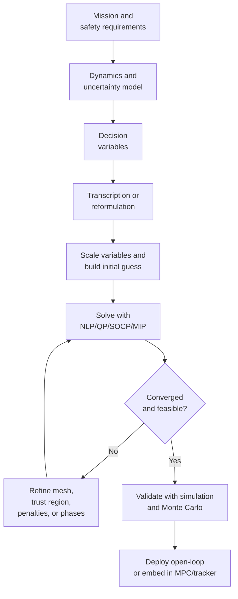
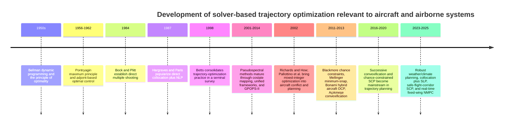

# Optimization Theory and Solver-Based Methods for Aircraft and Airborne Trajectory Generation

## Executive summary

This review assumes **no specific aircraft type or mission**. It covers solver-based trajectory generation for transport aircraft, fixed-wing UAVs, multirotors, and other airborne vehicles, while also citing a few non-aircraft papers from space and robotics when those papers introduced methods that later became standard in airborne trajectory optimization. The emphasis is on **model-based optimization**, **optimal control**, and **solver-centered formulations**, not machine learning. (sources: turn20view0, turn21search1, turn34search15)

The main engineering conclusion is straightforward: for most realistic aircraft trajectory-generation problems, the default workhorse is **direct transcription**—especially **direct collocation** or **pseudospectral transcription**—followed by a **large sparse nonlinear program** solved by derivative-based NLP solvers such as **IPOPT**, **SNOPT**, or **WORHP**. These methods handle many path constraints, multiphase flight segments, and practical aircraft models much better than classical indirect boundary-value formulations. **Indirect methods** remain important for theory, sensitivity analysis, and benchmark solutions, but they are usually not the first implementation choice for complex constrained aircraft problems. (sources: turn20view0, turn21search0, turn14view2, turn14view1, turn14view10, turn14view11)
> **Direct Transcription**, 直接离散化，直接转录。把连续时间优化问题转换成有限维度非线性规划(NLP, Nonlinear Programing)
> **Direct Collocation** 是 Direct Transcription 的一种高级实现，在离散点之间**配点(Collocation Points)**, 并要求动力学在这些配点上也成. 用多项式逼近轨迹.
> **Pseudospectral Transcription**, 更高级的方法，用高阶全局多项式逼近整个轨迹
> 
> $$\dot{x}(t) = f(x(t), u(t), t) $$
> IPOPT(Interior Point OPTimizer) 开源
> SNOPT(Sparse Nonlinear OPTimizer) 基于序列二次规划方(Sequential Quadratic Programming, SQP)
> KNITRO(Artelsy Knitro) 专用于求解非线性优化问题的软件包
> WORHP（We Optimize Really Huge Problems）

When the problem contains **logic**—for example, flight-level switches, conflict-resolution choices, passage side of an obstacle, waypoint disjunctions, or phase activation—continuous optimal control is not enough. Then the formulation becomes **mixed-integer** or **hybrid**, and solvers such as **Gurobi** or other MIP/MINLP tools become relevant. In air-traffic conflict resolution and hybrid flight planning, this is not a corner case but a core modeling issue. (sources: turn14view3, turn36search13, turn36search14, turn29view0, turn9search0)

For faster online replanning, recent work increasingly favors **convexification**, **sequential convex programming**, **successive convexification**, and **model predictive control**. These trade some globality for speed and solver reliability. A useful practical rule is: use **large sparse NLP** for high-fidelity, offline or pre-tactical planning; use **QP/SOCP-based convexification or MPC** for receding-horizon onboard guidance; and use **mixed-integer formulations** only when the logic is genuinely essential. Uncertainty is best represented explicitly with **stochastic**, **robust**, or **chance-constrained** formulations, but those approaches demand more from both the model and the solver. (sources: turn16search0, turn16search19, turn37view0, turn15search2, turn40view0, turn35search0, turn15search4, turn15search7, turn42view0, turn28search7)

## Problem formulation and modeling choices

A standard continuous-time trajectory-generation problem is an **optimal control problem**: choose a state history $x(\cdot)$, control history $u(\cdot)$, possibly static parameters $p$, and sometimes the start and end times, so as to minimize a terminal-plus-integral performance index subject to dynamics, path constraints, and boundary conditions. A common template is:

$$
\begin{aligned}
\min_{x(\cdot),u(\cdot),p,t_0,t_f}\quad
& \Phi\!\big(x(t_0),t_0,x(t_f),t_f,p\big)
+ \int_{t_0}^{t_f} L\!\big(x(t),u(t),p,t\big)\,dt \\
\text{s.t.}\quad
& \dot{x} = f(x,u,p,t), \\
& g(x,u,p,t)\le 0, \\
& \psi\!\big(x(t_0),t_0,x(t_f),t_f,p\big)=0 .
\end{aligned}
$$
> s.t. means such that, 表示满足条件

Here $L$ is the running cost, $\Phi$ is the endpoint cost, $g$ collects path constraints, and $\psi$ collects boundary/linkage constraints. This is the common backbone behind aircraft climb, cruise, descent, trajectory tracking, conflict-resolution, and obstacle-avoidance formulations. (sources: turn20view0, turn32view0)

The **dynamic model** determines almost everything that follows computationally. At one end are simple **kinematic** or geometry-based models, such as Dubins-like path generators. They are cheap and useful for front-end planning, but they can produce trajectories that are dynamically infeasible for the real aircraft. At the other end are **point-mass** and **6-DoF rigid-body** models, sometimes coupled to algebraic performance relations or atmosphere/wind models. Recent aircraft work still most commonly uses point-mass models for planning, because they keep the optimization manageable while representing thrust, drag, climb, mass burn, bank, and wind effects well enough for many mission-level questions. (sources: turn37view0, turn41view0, turn26view1)

> kinematic or geometry based model? 不对力建模，只关注路径形状
> point mass model? 建模升力/阻力/推力/重力

A representative aircraft point-mass formulation appears in flight-path optimization papers as

$$
\begin{aligned}
\dot V &= g\!\left(\frac{T\cos\alpha - D}{mg} - \sin\gamma\right),\\
\dot \gamma &= \frac{(T\sin\alpha + L)\cos\mu - mg\cos\gamma}{mV},\\
\dot{\psi}_h &= \frac{(T\sin\alpha + L)\sin\mu}{mV\cos\gamma},\\
\dot x &= V\cos\gamma\cos\psi_h,\qquad
\dot y = V\cos\gamma\sin\psi_h,\qquad
\dot h = V\sin\gamma .
\end{aligned}
$$

这些变量的含义如下。这里的 $g$ 表示重力加速度，不是前面通用最优控制模板里的路径约束函数 $g(\cdot)$。

| 符号 | 含义 |
|---|---|
| $V$ | 飞机沿航迹方向的速度，通常可理解为真空速 |
| $\gamma$ | 航迹角；正值表示爬升，负值表示下降 |
| $\psi_h$ | 水平面内的航向角或航迹角；下标 $h$ 表示 horizontal/heading，用来和前面的边界约束函数 $\psi(\cdot)$ 区分 |
| $x,y$ | 水平位置坐标 |
| $h$ | 高度 |
| $T$ | 推力大小 |
| $D$ | 阻力 |
| $L$ | 升力 |
| $m$ | 飞机质量 |
| $g$ | 重力加速度 |
| $\alpha$ | 迎角；在这个简化式中，它把推力分解为沿航迹方向的 $T\cos\alpha$ 和法向的 $T\sin\alpha$ |
| $\mu$ | 坡度角或滚转角；它把升力分解为竖直分量和横向转弯分量 |
| $\dot{(\ )}$ | 对时间求导，例如 $\dot V=dV/dt$ |

第一条方程描述的是**速度变化**。展开后等价于

$$
\dot V = \frac{T\cos\alpha-D}{m} - g\sin\gamma .
$$

其中 $T\cos\alpha-D$ 是沿航迹方向的净力：推力让飞机加速，阻力让飞机减速。$g\sin\gamma$ 是重力在航迹方向上的分量：爬升时它抵消加速，下降时它可能帮助加速。

第二条方程描述的是**航迹角变化**。分子比较的是速度法向上的可用力和重力法向分量：

$$
(T\sin\alpha+L)\cos\mu - mg\cos\gamma .
$$

升力和推力的法向分量会使速度方向向上转，重力会使速度方向向下转。除以 $mV$ 是把法向加速度转换成角速度。因此在同样的法向力下，飞机速度越大，航迹角 $\gamma$ 通常变化得越慢。

第三条方程描述的是**航向角变化**：

$$
\dot{\psi}_h = \frac{(T\sin\alpha + L)\sin\mu}{mV\cos\gamma}.
$$

只有法向力的横向分量会让飞机在水平面内转弯。这个横向分量主要由飞机倾斜产生，对应公式里的 $\sin\mu$。分母中的 $V\cos\gamma$ 是水平速度，因为 $\psi_h$ 是水平面内的角度。

最后三条方程是**位置运动学关系**。水平速度是 $V\cos\gamma$，航向角 $\psi_h$ 把它分解到 $x$ 和 $y$ 两个方向：

$$
\dot x = V\cos\gamma\cos\psi_h,\qquad
\dot y = V\cos\gamma\sin\psi_h .
$$

高度变化率是

$$
\dot h = V\sin\gamma .
$$

因此，$\gamma>0$ 表示高度增加，$\gamma<0$ 表示高度降低，$\gamma=0$ 在这个简化模型里对应平飞。

This is already rich enough to encode fuel-time-noise tradeoffs, flight-envelope limitations, terrain or approach-path geometry, and safety constraints. ATM-oriented planning often simplifies further to 3-DoF point-mass models with wind-coupled algebraic equations, latitude/longitude progression, and mass dynamics drawn from aircraft performance models such as BADA. (sources: turn26view1, turn41view2)
> flight-envelope: 飞行包线 飞行范围包络，指飞机能够安全飞行的所有边界集合

The objective function depends on the application. Common choices are **fuel burn**, **flight time**, **direct operating cost**, **tracking error**, **control effort**, **climate cost**, **noise metrics**, or weighted combinations of these. For commercial-aircraft 4D planning, multi-phase optimal-control formulations often combine fuel, time, emissions, and operational constraints; for UAS local planning, control smoothness and feasibility are often dominant; for ATM conflict resolution, the problem may even be a feasibility problem first and a cost-minimization problem second. (sources: turn34search1, turn36search8, turn13search3, turn29view0)

The decision variables can be split into two classes. **Continuous decisions** include thrust, bank angle, angle of attack, speed profile, climb rate, turn rate, or actuator histories. **Discrete decisions** include mode switches, whether to pass left or right of an obstacle, flight-level changes, whether to activate a phase, or which conflict-resolution maneuver family to choose. When those discrete decisions are important, the clean continuous OCP above becomes a **hybrid optimal-control problem** or a **mixed-integer optimal-control problem**. That modeling step is often more important than the eventual choice of solver. (sources: turn36search14, turn34search3, turn29view0)

Uncertainty can enter through wind, atmospheric forecasts, initial mass, state-estimation error, obstacle location, or tracking error. Deterministic solvers then branch into three common styles: **robust optimization** for worst-case or variability-penalized performance, **stochastic expected-value optimization** for average performance across scenarios, and **chance-constrained optimization** for explicit probabilistic safety requirements. In aircraft planning under wind uncertainty, ensemble weather forecasts have become a standard way to generate scenario-based robust or stochastic formulations. (sources: turn32view0, turn35search0, turn35search3, turn15search4, turn15search7, turn28search7)

## Core methods and mathematical ideas

### Pontryagin, Bellman, and what they mean for trajectories

Two grand theoretical viewpoints dominate trajectory optimization. The first is **Pontryagin-style optimal control**, which turns the problem into necessary conditions on states, controls, and **costates**—that is, time-varying Lagrange multipliers attached to the dynamics. The second is **Bellman-style dynamic programming**, which solves for the **value function**—the best possible remaining cost from each state—and in principle produces a feedback law directly. These are complementary, not competing, viewpoints. (sources: turn20view0, turn17search11, turn12search17)

> Costate: 协态变量 或 伴随变量, 和状态方程配套的一组“反向传播”的微分方程
> - 普通约束优化里，乘子告诉你某个约束的边际价值
> - 最优控制里，costate 告诉你某个状态轨迹约束/动力学约束的边际价值

For

$$
J = \Phi(x(t_f))+\int_{t_0}^{t_f}L(x,u,t)\,dt,\qquad \dot x=f(x,u,t),
$$

form the augmented functional

$$
\bar J=\Phi(x(t_f))+\int_{t_0}^{t_f}\left[L(x,u,t)+\lambda^\top\!\big(f(x,u,t)-\dot x\big)\right]dt.
$$

After integration by parts and first-order variation, one obtains the **Hamiltonian**

$$
H(x,u,\lambda,t)=L(x,u,t)+\lambda^\top f(x,u,t),
$$

and the familiar necessary conditions

$$
\dot x=\frac{\partial H}{\partial \lambda}=f,\qquad
\dot \lambda=-\frac{\partial H}{\partial x},\qquad
u^\star(t)=\arg\min_{u\in U} H(x^\star,u,\lambda^\star,t),
$$

plus endpoint transversality conditions. This is the theoretical basis of **indirect methods** and of shooting-based solvers. It is extremely informative because the costate often reveals the physical “shadow price” of altitude, mass, time, or separation constraints. (sources: turn20view0)

Bellman’s route starts from the **principle of optimality**: if the current state is $x$ at time $t$, then the first small slice of control plus the optimal continuation must itself be optimal. Writing

$$
V(x,t)=\min_{u(\cdot)}\left[\int_t^{t+\Delta t}L\,d\tau+V(x(t+\Delta t),t+\Delta t)\right]
$$

Subtracting $V(x,t)$ from both sides, approximating the short integral by $L(x,u,t)\Delta t$, and dividing by $\Delta t$ gives the intermediate residual form

$$
0=\min_{u\in U}\left(L(x,u,t)+\frac{V(x+f(x,u,t)\Delta t,t+\Delta t)-V(x,t)}{\Delta t}\right),\qquad \Delta t\to0.
$$

Expanding $V(x+f(x,u,t)\Delta t,t+\Delta t)$ to first order then yields the continuous-time **Hamilton–Jacobi–Bellman equation**

$$
0=\min_{u\in U}\Big(L(x,u,t)+V_t(x,t)+\nabla_x V(x,t)^\top f(x,u,t)\Big).
$$

> 这个式子叫 Hamilton-Jacobi-Bellman equation，简称 HJB。它不是在求一条单独的轨迹，而是在整个状态空间上求 value function $V(x,t)$。
> 左边的 $0$ 不是说代价为零，而是表示 Bellman 最优性条件的“残差”为零。直观推导是：从 $V(x,t)$ 出发，先走一个很小时间步 $\Delta t$，付出当前代价 $L\,\Delta t$，再加上下一状态的最优未来代价 $V(x+f\Delta t,t+\Delta t)$；把这个 Bellman 等式两边的 $V(x,t)$ 相减，再除以 $\Delta t$ 并令 $\Delta t\to0$，就得到 $0=L+V_t+\nabla_x V^\top f$。因此左边写成 $0$，表示“当前代价 + 未来 value function 的变化”在最优控制下必须刚好平衡。
> $V(x,t)$ 表示：系统在时间 $t$ 处于状态 $x$ 时，从这里继续到终点所能达到的最小未来代价。
> $L(x,u,t)$ 是当前这一瞬间的 running cost，例如燃油消耗率、时间代价或控制代价。
> $V_t(x,t)$ 是 value function 对时间的变化率，表示“剩余时间变少”会怎样改变未来最优代价。
> $\nabla_x V(x,t)^\top f(x,u,t)$ 表示当前控制 $u$ 通过动力学 $\dot{x}=f(x,u,t)$ 改变状态后，对未来代价造成的影响。
> $\min_{u\in U}$ 表示在所有允许控制里选择让“当前代价 + 未来代价变化”最小的控制。
> 所以 HJB 的直观意思是：最优控制在每个状态和时间上，都要让当前一步的代价与未来 value function 的变化达到最优平衡。解出 $V(x,t)$ 后，可以得到反馈策略，而不只是得到一条开环轨迹。

This is theoretically stronger than PMP because it characterizes optimal feedback, not just optimal trajectories. In aircraft work it has been used for low-dimensional flight-path optimization and feedback-style arrival/approach problems, but in practice it is most effective when the state dimension is modest. (sources: turn17search15, turn26view1, turn12search17, turn10search9)

The practical conclusion is easier to understand if the two theoretical routes are separated.

**PMP** means **Pontryagin Maximum Principle**. It is the basis of many **indirect methods**: first derive the necessary conditions for optimality, then solve the resulting equations. These equations include the original state dynamics, the costate dynamics, and the Hamiltonian optimality condition. The difficulty is that this usually becomes a **two-point boundary-value problem**: the aircraft state is constrained at the start, while costate or transversality conditions are often imposed at the end. Numerically, one has to guess missing costates, switching times, or arc structures so that the final boundary conditions are hit exactly. Small changes in those guesses can cause large terminal errors, especially for long aircraft trajectories, active path constraints, or multiphase missions.

**HJB/DP** means **Hamilton-Jacobi-Bellman / Dynamic Programming**. Instead of solving for one trajectory, it solves for a value function $V(x,t)$ over the state space. This is theoretically attractive because the value function gives a feedback policy: if the aircraft is at state $x$ at time $t$, the policy tells it what to do next. On a solved grid, this can provide global optimality relative to that grid. The difficulty is computational: if each state dimension uses $N$ grid points and the model has $n$ states, the grid can scale like $N^n$. Even a moderate aircraft model with states such as position, altitude, speed, flight-path angle, heading, and mass can become too large very quickly.

That is why **direct transcription** became the practical default in much aircraft trajectory optimization. It does not try to solve the costate boundary-value problem directly, and it does not solve over the entire state-space grid. Instead, it discretizes the trajectory itself: states and controls at time nodes become decision variables, dynamics become algebraic constraints, and the result is a large but sparse nonlinear program. This loses the clean global guarantees of HJB and usually gives only a local optimum, but it is much easier to combine with aircraft envelope constraints, fuel models, terrain or separation constraints, and multiphase flight procedures. (sources: turn20view0, turn26view1)

### Direct transcription, shooting, and collocation

**Direct methods** replace function-space optimization by a finite-dimensional optimization problem. The simplest variant is **single shooting**: parameterize only the control, integrate the differential equations forward, and optimize over control parameters. The drawback is fragility—errors or poor guesses can explode through the forward integration, especially for unstable dynamics or long horizons. **Multiple shooting** improves this by cutting the trajectory into segments and introducing intermediate state variables, then enforcing continuity between segments. Bock and Plitt’s 1984 paper is a classic here. (sources: turn24view0, turn18view2)

The other major class is **collocation**. Start from

$$
x_{k+1}-x_k=\int_{t_k}^{t_{k+1}} f(x(t),u(t),t)\,dt,
$$

then approximate the integral numerically and enforce the resulting algebraic relation as a constraint. For **trapezoidal collocation**,
> trapezoidal: 梯形的

$$
x_{k+1}-x_k \approx \frac{h_k}{2}\big(f_k+f_{k+1}\big),
$$

where $h_k=t_{k+1}-t_k$. This relation is often called a **defect constraint**—meaning the discretized dynamics residual that must be driven to zero. For trapezoidal collocation, the defect on interval $k$ can be written as

$$
\Delta_k =
x_{k+1}-x_k-\frac{h_k}{2}\big(f_k+f_{k+1}\big).
$$

> Defect constraint 可以理解成“动力学残差约束”或“离散动力学误差约束”。优化器会选择节点状态 $x_k,x_{k+1}$ 和控制量，但这些节点不能随便连起来；它们必须近似满足连续动力学 $\dot{x}=f(x,u,t)$。如果 $\Delta_k\ne0$，说明相邻两个状态点之间的变化和动力学积分预测不一致；如果强制 $\Delta_k=0$，就表示这段离散轨迹 obey dynamics。这里的 defect 不是“故障”，而是“离散化后留下的动力学误差”。 (sources: turn19view0, turn19view1)

For **Hermite–Simpson collocation**, the same integral is approximated by Simpson quadrature:

$$
x_{k+1}-x_k \approx \frac{h_k}{6}\Big(f_k+4f_{k+\frac12}+f_{k+1}\Big),
$$

with the midpoint state approximated by

$$
x_{k+\frac12}\approx \frac12(x_k+x_{k+1})+\frac{h_k}{8}(f_k-f_{k+1}).
$$

This raises the local order of accuracy and usually improves smoothness and solver behavior for many aircraft problems. Kelly’s tutorial remains one of the clearest modern introductions. (sources: turn18view1, turn19view2, turn19view3, turn14view2)

Why do engineers like collocation so much? Because it exposes a **large sparse NLP**. Each node mainly couples only to nearby nodes, so Jacobians and Hessians have exploitable structure. This is exactly the regime where sparse derivative-based NLP solvers are strong. Hargraves and Paris’ 1987 paper helped establish this practical direction, and Betts’ later work consolidated it into the standard aircraft and aerospace workflow. (sources: turn25view0, turn21search0, turn21search1, turn20view0)

### Pseudospectral methods

**Pseudospectral methods** are a global form of orthogonal collocation: instead of using many local low-order segments, one approximates the state by high-order polynomials over the whole phase—or over hp-adaptively refined mesh elements—and enforces the dynamics at carefully chosen nodes such as **Legendre–Gauss**, **Legendre–Gauss–Radau**, or **Legendre–Gauss–Lobatto** points. The attraction is rapid convergence for smooth solutions and a deep connection between NLP multipliers and continuous-time costates. (sources: turn22search0, turn23search1, turn23search2, turn14view1)

A good mental model is this: local collocation behaves like a finite-element method, while pseudospectral methods behave more like a high-order spectral approximation. For very smooth flight segments, pseudospectral methods can be remarkably accurate with relatively few nodes. That is why tools such as **GPOPS-II** became so influential in aerospace. GPOPS-II uses **hp-adaptive Gaussian quadrature collocation** and transcribes the OCP to a sparse NLP with mesh refinement. (sources: turn14view1, turn38search3)

The catch is that global polynomial methods are less comfortable with **nonsmooth structure**—for example, sharp switching, bang-bang controls, active-set changes, or singular arcs—unless the phase structure is chosen carefully. GPOPS-II’s own paper explicitly notes that solutions near singular arcs may be inaccurate unless the singular conditions are added to the model. That is a useful warning for aircraft problems with throttle saturation, time-optimal segments, or mode boundaries. (sources: turn14view1)

### Convexification, sequential convex programming, and chance constraints

Many trajectory problems are nonconvex because of nonlinear dynamics, obstacle-avoidance geometry, aerodynamic envelopes, and separation constraints. A common modern tactic is **sequential convex programming** or **successive convexification**. If the full problem is written as

$$
\min_z J(z)\quad \text{s.t.}\quad c(z)=0,\quad g(z)\le 0,
$$

then around a reference iterate $z^{(i)}$, one solves a convex subproblem in the step $\Delta z$:

$$
\begin{aligned}
c(z^{(i)})+\nabla c(z^{(i)})\Delta z &= 0,\\
g(z^{(i)})+\nabla g(z^{(i)})\Delta z &\le 0,\\
\|\Delta z\| &\le \rho_i,
\end{aligned}
$$

possibly with **virtual controls** or **exact penalties** to preserve feasibility. The bound $\rho_i$ is the **trust region**—a solver-imposed step limit meant to keep the linearization credible. The solution is then updated by $z^{(i+1)}=z^{(i)}+\Delta z$. (sources: turn16search0, turn37view0, turn14view7)

A special case is **lossless convexification**, where a specific nonconvex constraint set can be turned into a convex one *without changing the optimal solution*. This idea was developed most famously in flight-vehicle guidance with nonconvex control-bound or pointing constraints, and it strongly influenced later airborne applications even when exact “losslessness” no longer holds and one switches to sequential convexification instead. (sources: turn16search19, turn16search2)

For uncertainty, a canonical formulation is the **chance constraint**

$$
\mathbb{P}\big(g_j(x_k,u_k,\xi_k)\le 0\big)\ge 1-\varepsilon_j ,
$$

where $\xi_k$ represents uncertainty and $\varepsilon_j$ is the allowed risk budget. In practice, these are handled by deterministic reformulations, conservative uncertainty margins, scenario sampling, risk allocation, or chance-constrained MPC/SCP variants. This is attractive because it encodes safety in the language engineers actually use—“keep collision probability below $10^{-3}$”—but it raises both modeling and computational burden. (sources: turn15search7, turn42view0, turn28search7, turn40view1)

A useful special airborne case is the **minimum-snap polynomial** formulation for differentially flat multirotors. If a flat output $p(t)$ is represented by piecewise polynomials $p_i(t)$, one solves a convex QP such as

$$
\min_a \sum_i \int_{t_i}^{t_{i+1}}\left\|\frac{d^4 p_i(t)}{dt^4}\right\|^2 dt
$$

subject to waypoint, corridor, continuity, and derivative-bound constraints. For quadrotors this is elegant, fast, and influential—but it is also a specialized modeling trick, not a universal aircraft method. (sources: turn43search6, turn43search0)

## Solver-centered modeling patterns in aircraft trajectory generation

The modeling-to-solver pipeline in current aircraft trajectory work is usually less about “finding the perfect algorithm” than about **matching model structure to solver structure**. Smooth multi-phase OCPs with many continuous variables are typically sent to sparse NLP solvers; binary logic is isolated into MIP or MINLP layers; and repeated receding-horizon problems are condensed into QP/SOCP/NMPC forms that can be solved in milliseconds to seconds depending on horizon and model size. Recent aircraft and UAV papers follow exactly this pattern. (sources: turn34search1, turn36search14, turn37view0, turn40view0, turn35search0)

In practice, modern groups often combine **front-end geometry** with **back-end optimal control**. A safe corridor or rough waypoint route is first generated by a simple planner; then a continuous optimization stage smooths it into a dynamically feasible trajectory. Fixed-wing UAV work using **safe flight corridors plus SCP** is a good current example. Another current pattern is **collocation plus successive linear programming**, where the sparse collocation structure is retained but the nonlinear solve is broken into a sequence of LPs or QPs for speed and robustness. (sources: turn14view7, turn37view0)

The table below summarizes the main method families from a solver-centric viewpoint.

| Method family | Continuous vs. discrete decisions | Typical airborne model | Main strengths | Main limitations | Good solver/tool stack | Key source(s) |
|---|---|---|---|---|---|---|
| **Indirect PMP + shooting** | Mostly continuous | Smooth ODEs, low-to-moderate complexity | Very sharp theory, good sensitivity insight, costates come “for free” | Sensitive boundary-value solve; awkward with many path inequalities and mode logic | Boundary-value solvers; sometimes shooting wrapped in SNOPT/IPOPT | (sources: turn20view0, turn26view1) |
| **Direct single shooting** | Continuous | Short horizons, simple controls, accurate integration needed | Small decision vector; easy conceptually | Sensitive to initial guess; poor handling of many path constraints | CasADi/ACADO front ends + NLP solver | (sources: turn18view2, turn11search11) |
| **Direct multiple shooting** | Continuous | Nonlinear or unstable dynamics, moderate path constraints | More robust than single shooting; accurate integration on each segment | NLP becomes denser than collocation; continuity constraints add size | ACADO/CasADi + IPOPT/SNOPT/WORHP | (sources: turn24view0, turn18view2, turn11search7) |
| **Local collocation** | Continuous, possibly multiphase | Point-mass to 6-DoF aircraft OCPs | Sparse NLP; path constraints are natural; strong practical default | Mesh choice matters; still only local optima | IPOPT, SNOPT, WORHP via ICLOCS2, FALCON.m, CasADi | (sources: turn25view0, turn14view2, turn21search1, turn38search0, turn38search2) |
| **Pseudospectral / hp-adaptive collocation** | Continuous, multiphase | Smooth long-horizon trajectories | Very high accuracy on smooth problems; multiplier–costate links; mesh refinement | Less friendly to nonsmooth arcs; singular arcs need care | GPOPS-II + IPOPT/SNOPT | (sources: turn23search1, turn23search2, turn14view1, turn38search3) |
| **Lossless convexification / SCP / SCvx / SLP** | Continuous | Nonconvex obstacle-avoidance, envelope, or guidance problems | Fast convex subproblems; good for online replanning; strong recent momentum | Needs trust-region and penalty design; usually local convergence | MOSEK / ECOS for conic forms; OSQP / HPIPM for QP forms; custom SCP code | (sources: turn16search19, turn16search0, turn37view0, turn14view7) |
| **MILP / MIQP / MINLP / hybrid OCP** | Continuous + discrete | Conflict resolution, waypoint logic, flight-level changes, hybrid procedures | Handles logic explicitly; can yield global optima relative to the model | Combinatorial growth; often needs simplified dynamics or decomposition | Gurobi for MIP/MIQP/MIQCP; MINLP stacks for hybrid models | (sources: turn14view3, turn36search13, turn36search14, turn29view0, turn9search0) |
| **MPC / NMPC** | Continuous, sometimes mixed-integer or stochastic | Tracking, local replanning, onboard guidance | Feedback, warm starting, constraint handling, natural online use | Horizon myopia; repeated solves; model mismatch matters | acados + HPIPM; qpOASES / OSQP for linear MPC; FORCESPRO for embedded deployments | (sources: turn15search2, turn40view2, turn40view1, turn40view0, turn39search3, turn39search5, turn39search2) |
| **DP / HJB** | Continuous or discrete on a grid | Simplified feedback planning, low-dimensional approach or conflict models | Direct feedback policy; global optimality on solved state grid | Computationally heavy as dimension grows | Custom DP/PDE solvers | (sources: turn17search15, turn26view1, turn12search17) |
| **Chance-constrained OCP / MPC** | Continuous, sometimes plus discrete risk allocation | Wind uncertainty, obstacle uncertainty, collision-probability limits | Encodes risk directly; better safety interpretation | Distribution assumptions, conservatism, extra computation | Scenario-based MPC/SCP, deterministic reformulations, sampling-based planners | (sources: turn15search7, turn42view0, turn28search7, turn40view1) |

A second practical question is simple but important: **which solver should I actually use?** The short answer is “match the algebraic form.” Derivative-based sparse NLP solvers such as IPOPT, SNOPT, and WORHP remain the standard choices for smooth direct-transcription problems; conic or QP solvers such as MOSEK, ECOS, OSQP, HPIPM, and qpOASES are natural when the subproblem is convexified into LP/QP/SOCP form; and Gurobi is a strong default when binary decisions are unavoidable. Modeling/AD frameworks such as CasADi, ACADO, FALCON.m, ICLOCS2, and GPOPS-II matter almost as much as the solver itself because they determine derivative quality, sparsity exploitation, and ease of mesh refinement. (sources: turn14view9, turn14view10, turn14view11, turn9search1, turn8search7, turn9search2, turn39search5, turn39search12, turn9search0, turn8search2, turn11search11, turn38search2, turn38search4, turn14view1)

| Problem type | Recommended solver stack | Why this is usually a good fit | Key source(s) |
|---|---|---|---|
| Smooth, sparse, offline aircraft OCP | **IPOPT**, **SNOPT**, **WORHP** | Handles large sparse NLPs from collocation/pseudospectral transcriptions | (sources: turn14view9, turn14view10, turn14view11) |
| Multi-phase hp-pseudospectral OCP | **GPOPS-II** with **IPOPT/SNOPT** | Mature aerospace workflow for smooth multi-phase problems | (sources: turn14view1, turn38search3) |
| Rapid prototyping of direct transcription or NMPC | **CasADi**, **ACADO**, **ICLOCS2**, **FALCON.m** | Automatic differentiation, code generation, and structured OCP interfaces | (sources: turn8search2, turn11search11, turn38search4, turn38search2) |
| Real-time QP-based MPC / convexified replanning | **acados + HPIPM**, **qpOASES**, **OSQP** | Fast repeated QP solves with OCP structure and warm-start support | (sources: turn39search3, turn39search5, turn39search12, turn9search2) |
| Conic SCP / SOCP formulations | **MOSEK**, **ECOS** | Strong support for conic optimization and embedded SOCPs | (sources: turn9search1, turn8search7) |
| Mixed-integer conflict/hybrid logic | **Gurobi** | Mature MIP/MIQP/MIQCP support for branch-and-bound/branch-and-cut workflows | (sources: turn9search0, turn29view0) |
| Embedded repeated NMPC solves | **FORCESPRO**, **acados** | Designed for repeated real-time solves and code generation | (sources: turn39search2, turn39search3) |

One practical recommendation deserves to be stated plainly: **scaling and derivatives are not housekeeping details; they are often the difference between success and failure**. Solver documentation and modern OCP software consistently emphasize analytic derivatives, automatic differentiation, and careful structure exploitation. (sources: turn14view11, turn8search2, turn38search2)

## Seminal papers, current directions, and how the field developed

The broad development arc is from general optimal-control theory, to multiple shooting and collocation, to sparse-NLP software, and then to modern real-time convexification, MPC, and uncertainty-aware planning. Bellman’s dynamic programming and Pontryagin’s maximum principle set the theory; Bock, Hargraves, and Betts made numerical trajectory optimization practical; pseudospectral methods pushed accuracy and multiplier recovery; mixed-integer aviation papers handled logic and conflict resolution; and current work emphasizes robust weather-aware planning, real-time convexification, and chance-constrained safety. (sources: turn17search11, turn17search2, turn24view0, turn25view0, turn21search0, turn23search1, turn14view1, turn14view3, turn36search14, turn35search0, turn37view0, turn42view0)

In the tables below, the final column preserves the source IDs from the original generated report.

| Foundational paper | Why it matters | Source IDs |
|---|---|---|
| **Bock & Plitt (1984), “A Multiple Shooting Algorithm for Direct Solution of Optimal Control Problems”** | The classic direct multiple-shooting paper; still foundational for robust shooting-based OCP transcription. | (sources: turn24view0) |
| **Hargraves & Paris (1987), “Direct trajectory optimization using nonlinear programming and collocation”** | One of the seminal “direct collocation + NLP” papers in aerospace practice. | (sources: turn25view0) |
| **Betts (1998), “Survey of Numerical Methods for Trajectory Optimization”** | The canonical survey that organized direct vs. indirect methods for trajectory applications. | (sources: turn21search0) |
| **Fahroo & Ross (2001), “Costate Estimation by a Legendre Pseudospectral Method”** | Important bridge between direct pseudospectral discretizations and indirect-style costate information. | (sources: turn23search3) |
| **Richards & How (2002), “Aircraft Trajectory Planning With Collision Avoidance Using Mixed Integer Linear Programming”** | Early, highly influential use of MILP for aircraft collision avoidance and large-scale fixed-wing maneuvers. | (sources: turn36search25, turn36search13) |
| **Pallottino, Feron & Bicchi (2002), “Conflict Resolution Problems for Air Traffic Management Systems Solved with Mixed Integer Programming”** | Foundational aircraft-conflict MIP paper; still a reference point for ATM optimization. | (sources: turn14view3) |
| **Garg et al. (2010), “A unified framework for the numerical solution of optimal control problems using pseudospectral methods”** | Standard reference on LG/LGR/LGL pseudospectral transcription. | (sources: turn23search1, turn23search5) |
| **Blackmore, Ono & Williams (2011), “Chance-Constrained Optimal Path Planning With Obstacles”** | Seminal chance-constrained planning paper; not aviation-specific, but methodologically central for risk-bounded airborne planning. | (sources: turn15search7, turn15search10) |
| **Mellinger & Kumar (2011), “Minimum snap trajectory generation and control for quadrotors”** | Influential QP-based trajectory generation special case for airborne robots with differential flatness. | (sources: turn43search6, turn43search0) |
| **Bonami et al. (2013), “Multiphase Mixed-Integer Optimal Control Approach to Aircraft Trajectory Optimization”** | Clear formulation of aircraft trajectory generation as a hybrid problem with discrete and continuous decisions. | (sources: turn36search2, turn36search14) |
| **Patterson & Rao (2014), “GPOPS-II”** | The most widely cited hp-adaptive pseudospectral software reference in aerospace OCP. | (sources: turn14view1) |

| Recent representative paper | Why it matters now | Source IDs |
|---|---|---|
| **Eren et al. (2017), “Model Predictive Control in Aerospace Systems: Current State and Opportunities”** | Broad review of MPC in aerospace; useful orientation before diving into aircraft-specific MPC designs. | (sources: turn15search2, turn15search6) |
| **González-Arribas, Soler & Sanjurjo-Rivo (2018), “Robust Aircraft Trajectory Planning Under Wind Uncertainty Using Optimal Control”** | Important aircraft paper on robust scenario-based planning under ensemble wind forecasts. | (sources: turn32view0) |
| **Mammarella et al. (2017), “Sample-based SMPC for tracking control of fixed-wing UAV”** | Representative stochastic MPC paper for fixed-wing UAVs under uncertainty and noise. | (sources: turn40view1) |
| **Mao, Szmuk & Açıkmeşe (2016), “Successive Convexification of Non-Convex Optimal Control Problems and Its Convergence Properties”** | Core SCvx reference for nonconvex trajectory optimization. | (sources: turn16search0) |
| **Lew, Bonalli & Pavone (2020), “Chance-Constrained Sequential Convex Programming for Risk-Aware Trajectory Optimization”** | Strong modern treatment of chance-constrained SCP with convergence guarantees. | (sources: turn42view0) |
| **Reinhardt, Gros & Johansen (2023), “Fixed-Wing UAV Path-Following Control via NMPC on the Actuator Level”** | Good current NMPC example for fixed-wing UAVs with real-time ambition. | (sources: turn40view0) |
| **Simorgh et al. (2024), “Robust 4D climate-optimal aircraft trajectory planning under weather-induced uncertainties”** | Current state of the art for robust weather/climate-aware 4D aircraft planning in free-route airspace. | (sources: turn35search0, turn35search3) |
| **Lu, Hong & Holzapfel (2024), “Flight Trajectory Generation through a Collocation Approach with Successive Linear Programming”** | Shows the current trend of combining collocation structure with LP-based sequential linearization for speed. | (sources: turn37view0) |
| **Glasheen, Bird & Frew (2024), “Experimental Assessment of Chance-Constrained Motion Planning for Small Uncrewed Aircraft”** | Valuable because it moves from algorithm papers to field experiments on fixed-wing sUAS. | (sources: turn28search7) |
| **Sun et al. (2025), “Safe flight corridor constrained sequential convex programming for efficient trajectory generation of fixed-wing UAVs”** | Representative of the current “front-end corridor + back-end SCP” design pattern. | (sources: turn10search2, turn14view7) |
| **Cafieri et al. (2023), “Mixed-integer nonlinear and continuous optimization formulations for aircraft conflict avoidance via heading and speed deviations”** | Good modern example of combining continuous and discrete optimization ideas for ATM conflict problems. | (sources: turn29view0) |

A useful comparative reading path for students is this. Read **Betts (1998)** to understand why direct methods took over; then read **Kelly (2017)** for an implementable, friendly account of collocation; follow with **Garg et al. (2010)** and **GPOPS-II** for pseudospectral methods; then compare **Pallottino/Richards/Bonami/Cafieri** for mixed-integer logic; and finally compare **Mao/Lew/Lu/Sun** for current convexification-based real-time planning. That sequence mirrors the historical move from theory-first formulations to solver-first engineering. (sources: turn21search0, turn14view2, turn23search1, turn14view1, turn14view3, turn36search13, turn36search14, turn29view0, turn16search0, turn42view0, turn37view0, turn14view7)

## Open questions and limitations

This review intentionally excluded **machine learning** and **data-driven** planners, even when modern papers combine them with optimization. It also emphasized methods that are reusable across aircraft classes, so mission-specific topics such as aeroelastic trajectory optimization, detailed propulsion scheduling, or certification-oriented implementation details were only touched indirectly. Some recent journal papers were only accessible through abstracts or repository versions rather than full publisher text, so the report prioritizes high-confidence methodological claims over exhaustive detail where access was limited.

A final caution for beginners: there is **no universally best method**. The best choice depends mainly on five structural questions: how nonlinear the dynamics are, how many path constraints are active, whether discrete logic matters, whether uncertainty must be explicit, and whether the solve must run offline or in real time. If those five issues are answered well, the solver choice usually becomes much easier.
